# Day 03 – Linux Commands Practice

## Task
Today’s goal is to **build your Linux command confidence**.

You will create a cheat sheet of commands focused on:
- Process management
- File system
- Networking troubleshooting

This is the command toolkit you will reuse for years.

---

## Guidelines
Follow these rules while creating your cheat sheet:

- Include **at least 20 commands** with one‑line usage notes

man - manual for linux commands

ls - to list contents of directory/current directory

pwd - to list present working directory

touch - to change the timestamp of a file but its mostly used to create a filename

cp - copy file/directory from 1 location to another

mv - move file/directory from 1 location to another. its used to rename too.

mkdir - to make directory
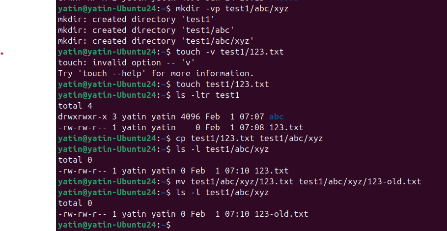

rm - to remove file/directory. **NOTE** - Never use **rm -rf** always use loop or individual directory to remove.

echo - print on screen the text/line or variable passed

cat - to print file contents on screen or standard output or monitor
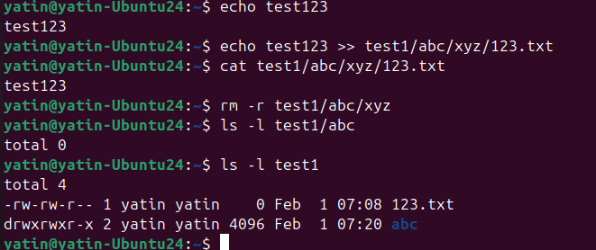

df - displays file system space usage. Below -h used for human readable format, -T to include type of disk
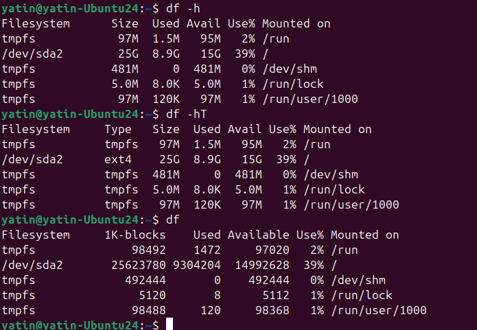

whoami - print user name

id - print user name and group details
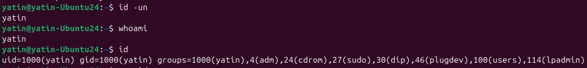

rmdir - remove empty directory

uname - print system information. OS release
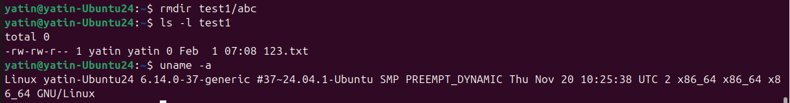

ps - display current processes

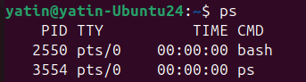
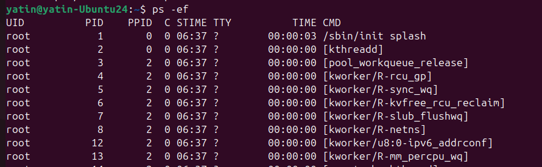
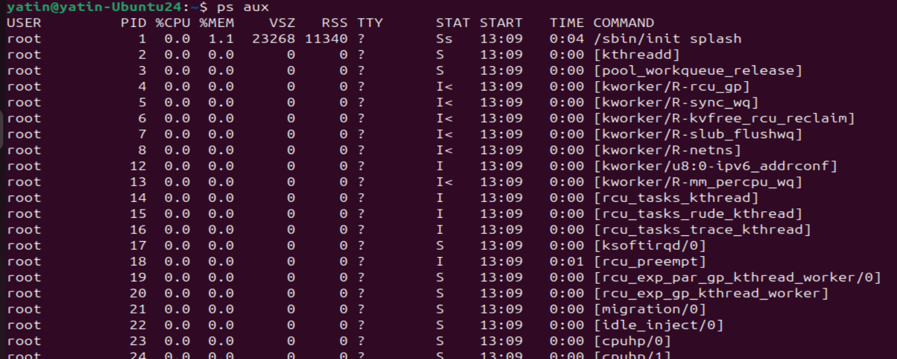

top - display dynamic (changing) view of system processes
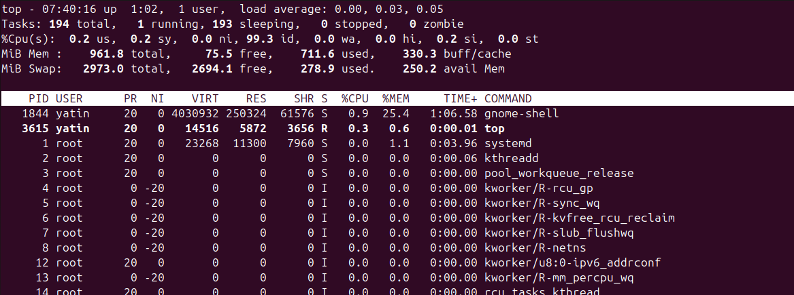

htop - user friendly variant of top
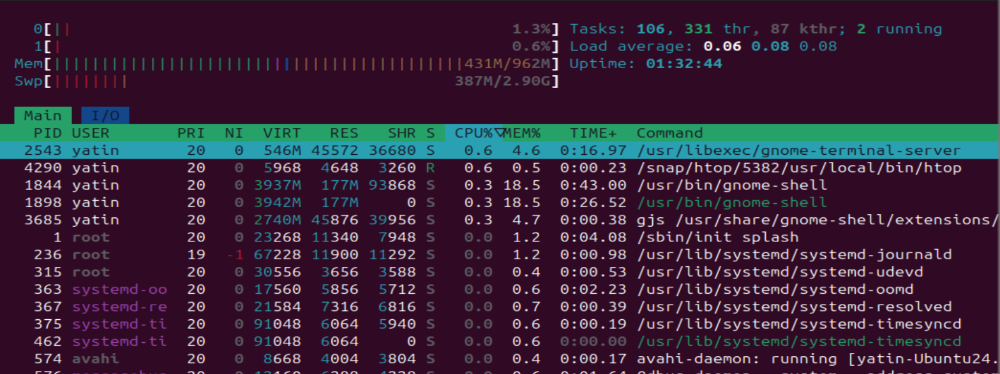

kill - send signal to process. Generally used to kill process with kill -9 <PID>
nohup - run command in background, even a user logout it keep on running.
pstree - display running process in tree format, showing parent-child relationship.

- Add **3 networking commands** (`ping`, `ip addr`, `dig`, `curl`, etc.)
ping - to test ICMP packet to network host/ip address

ip aadr or ip a - to print ethernet interface on the host
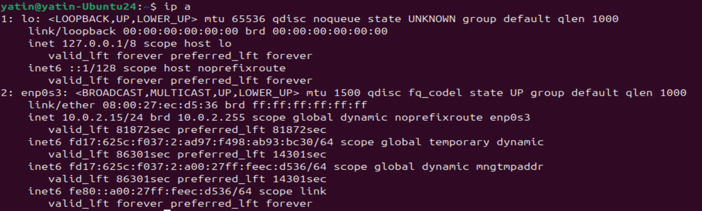

dig - DNS lookup utility
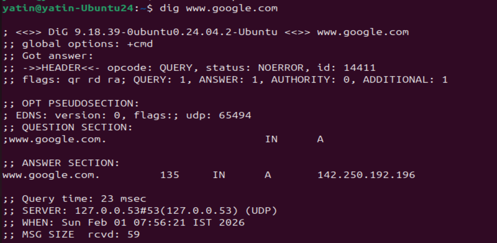

nslookup - query DNS interactively

curl - used to transfer data over the internet from host to server using various protocol like HTTP, FTP, SCP HTTPS etc. helpful in testing REST API. used to download, upload and send data using terminal. 
Below simply display contents of google.com on terminal.
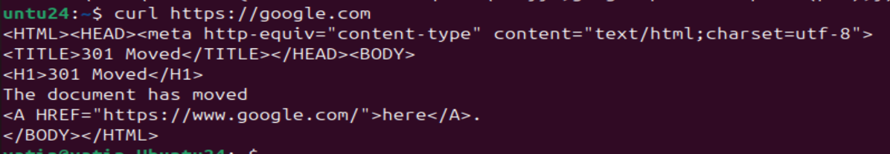

find - to find a file 
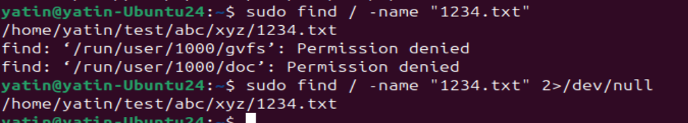

below output search .txt file in present directory
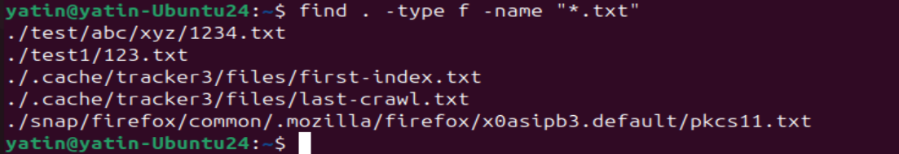

below output find and then execute ls -l for those files

free - memory usage information
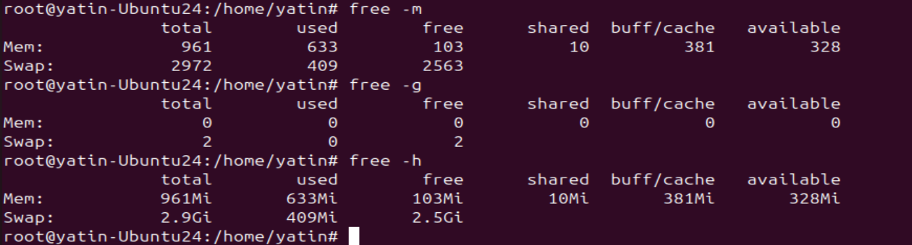

- Group commands by category
- Keep it concise and readable

---

## Why This Matters for DevOps
Real production issues are solved at the command line.

The faster you can inspect logs and network issues, the faster you can:
- Restore service
- Reduce downtime
- Gain trust as an operator

---