# Day 04 – Linux Practice: Processes and Services

## Task
Today’s goal is to **practice Linux fundamentals with real commands**.

You will create a short practice note by actually running basic commands and capturing what you see:
- Check running processes
- Inspect one systemd service
- Capture a small troubleshooting flow

This is hands-on. Keep it simple and focused on fundamentals.

---

## Guidelines
Follow these rules while creating your practice note:

- Run and record output for **at least 6 commands**
- Include **2 process commands** (`ps`, `top`, `pgrep`, etc.)

ps aux - process information for all user
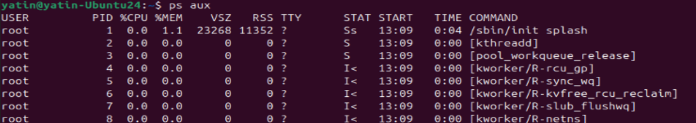

User - who ran it
PID - process ID
%CPU/MEM - CPU and memory usage
VSZ - virtaul memory size in KB
RSS - Non swapped physical memory
STAT - Process status (Running, Zombie, sleeping)
START - Start time of process

ps -ef - list all process in standard full format
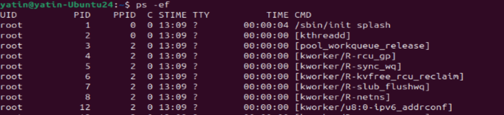

UID - user ID
PPID - Parent Process ID
C - CPU utilization

ps -u yatin - to display process for user names yatin
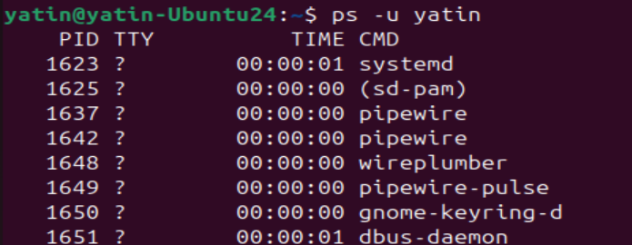

top
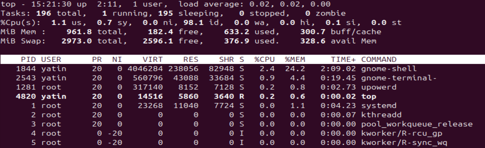

1st line - server up time, no. of user logged in, average load for 1,5,15 mins
2nd line - total number of processes, count of running, sleeping, stopped, zombie
3rd line - CPU usage by us-(user), sy-(system), etc
4th & 5th line - Memory usage by physical and swap memory respectively
Task (Process) area below
PR - process priority
SHR - Shared memory

- Include **2 service commands** (`systemctl status`, `systemctl list-units`, etc.)

systemctl - primary CLI for managing systemd init system in linux. example usage

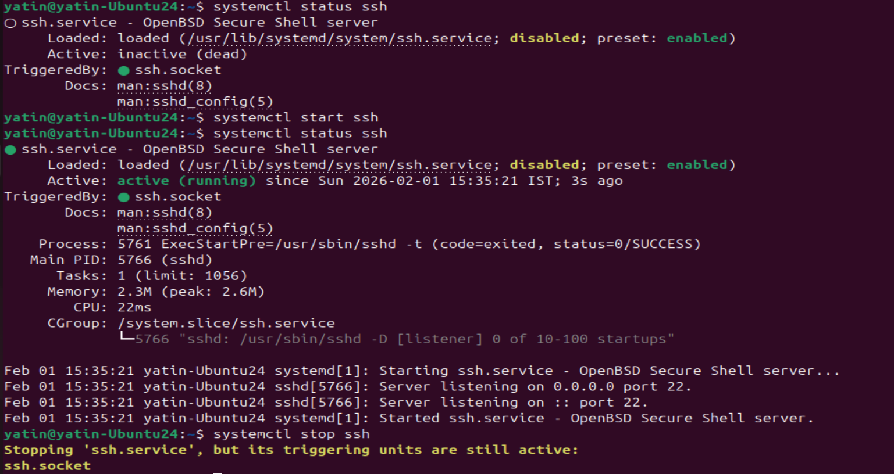
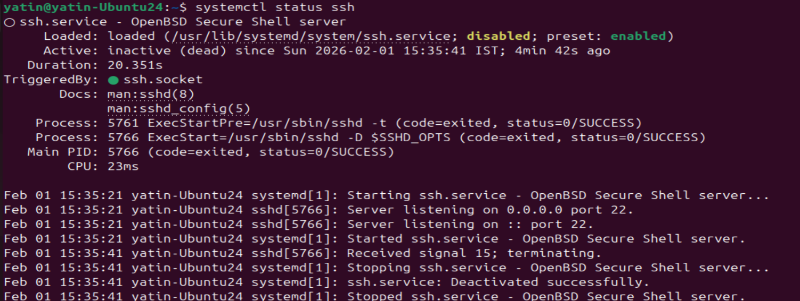

systemctl list-units - all loaded and active systemd units
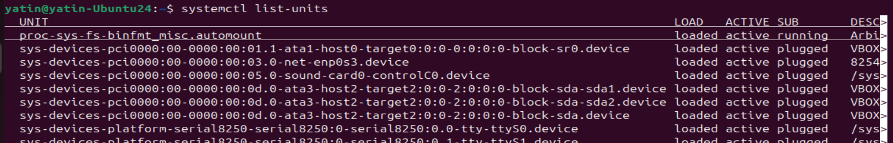

systemctl list-unit-files - displays if its enabled at start at boot

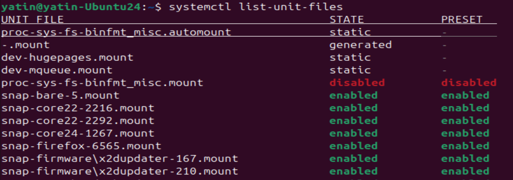

STATE - enablement status
PRESET - Vendor status

- Include **2 log commands** (`journalctl -u <service>`, `tail -n 50`, etc.)

journalctl -u <Servicename> - to display logs for particular service in human readable format

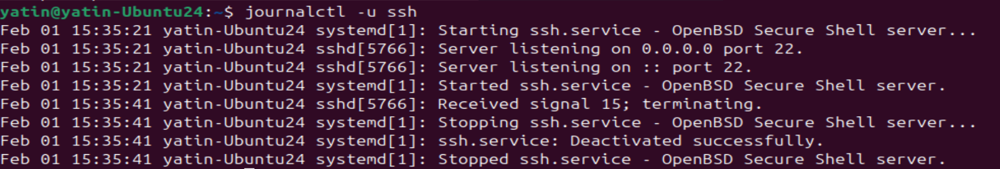

journalctl -n <n> - display last 'n' number of lines
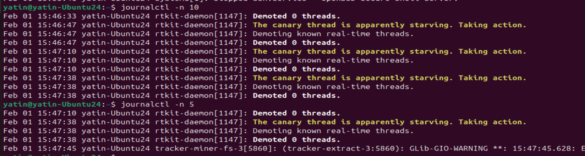

journalctl -k - logs from kernel
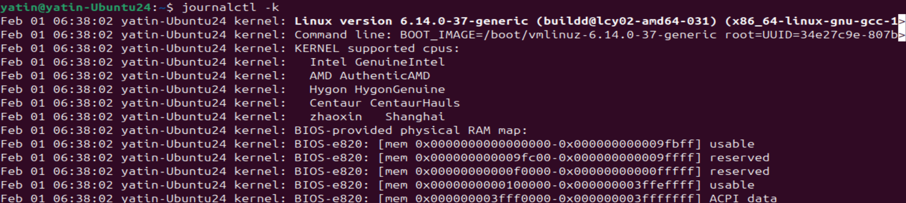

- Pick **one service on your system** (example: `ssh`, `cron`, `docker`) and inspect it

ssh - to login to remot system
cron - automatic scheduler of linux
crontab -l - list cron entry for logged in user
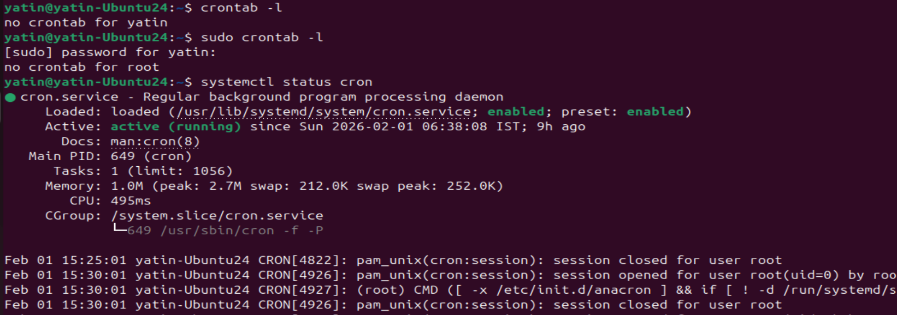

docker - docker related CLI

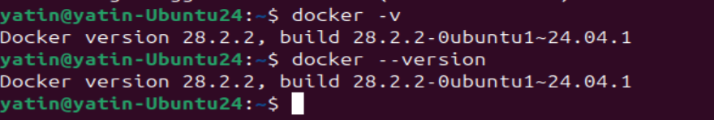

docker run hello-world - does not found hello-world image locally so pulled, runs in container and print a message and exits
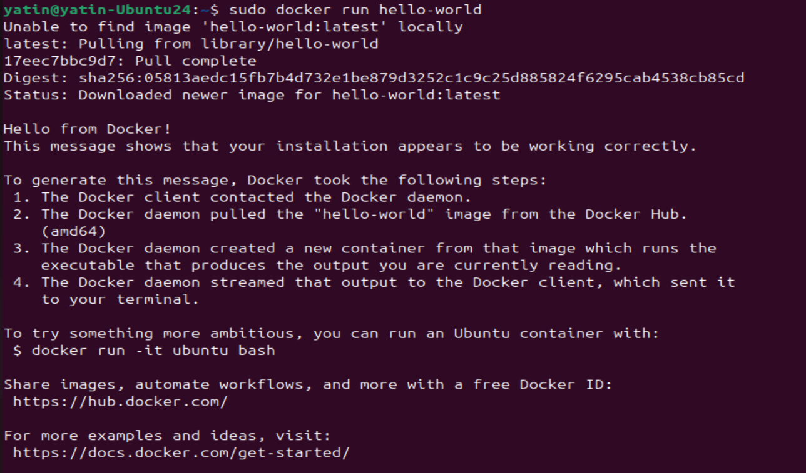

docker ps - docker related processes running
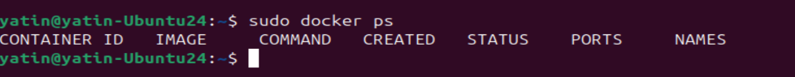

- Keep it **simple and actionable**

Suggested structure for `linux-practice.md`:
- Process checks
- Service checks
- Log checks
- Mini troubleshooting steps

---

## Resources
You may refer to:

- Your notes from Day 02 and Day 03
- Linux `man` pages
- Your class notes

---

## Why This Matters for DevOps
Hands‑on practice builds speed and confidence.

When issues happen in production, you won’t have time to search for basic commands.  
This day helps you build muscle memory with Linux fundamentals.

---
