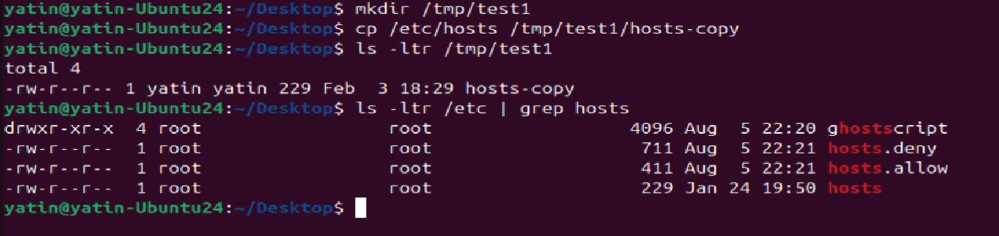
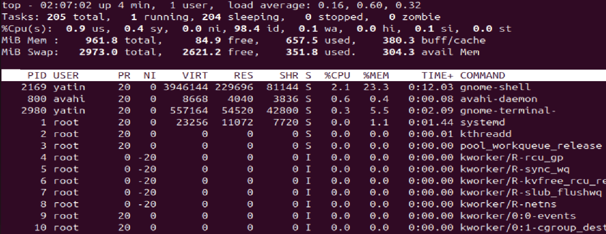
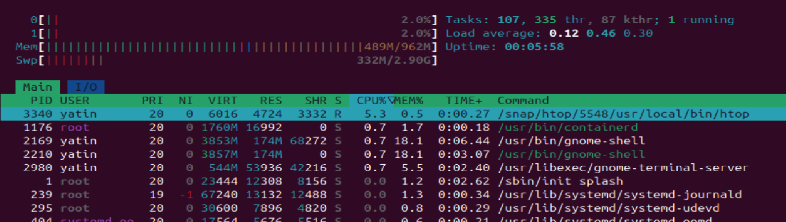
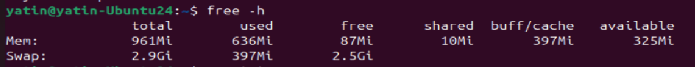
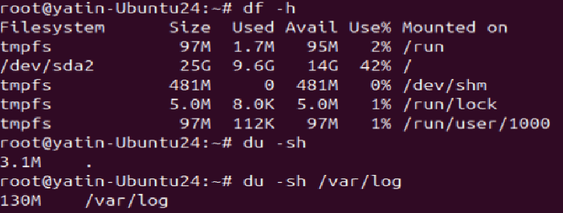
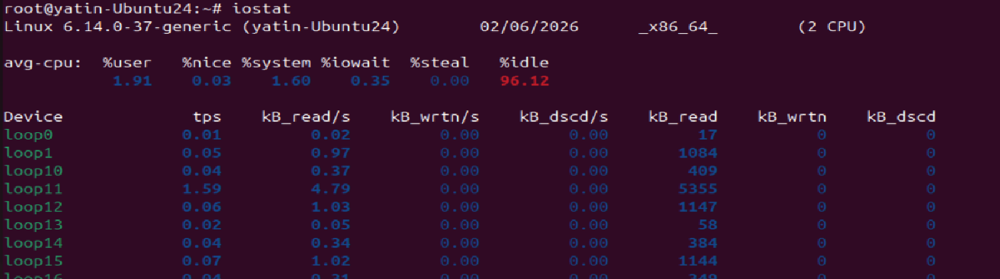
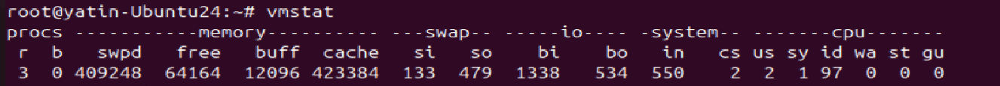
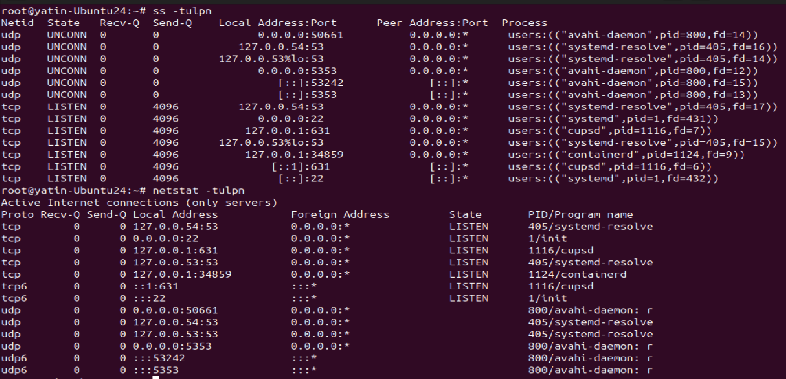
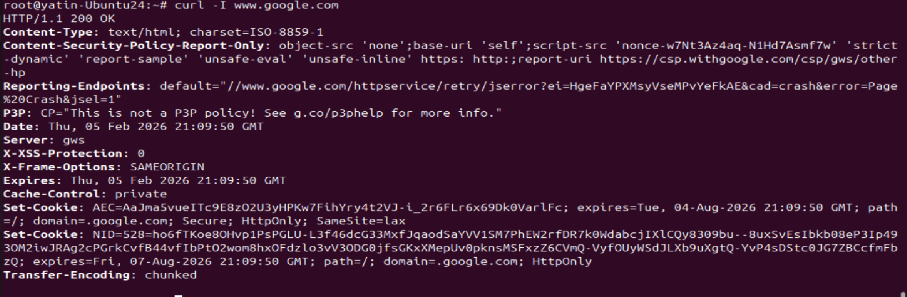

# Day 05 – Linux Troubleshooting Drill: CPU, Memory, and Logs

## Task
Today’s goal is to **run a focused troubleshooting drill**.

You will pick a running process/service on your system and:
- Capture a quick health snapshot (CPU, memory, disk, network)
- Trace logs for that service
- Write a **mini runbook** describing what you did and what you’d do next if things were worse

This turns yesterday’s practice into a repeatable troubleshooting routine.

### What’s a runbook?
A **runbook** is a short, repeatable checklist you follow during an incident: the exact commands you run, what you observed, and the next actions if the issue persists. Keep it concise so you can reuse it under pressure.

---

## Guidelines
Follow these rules while creating your runbook:

- Run and record output for **at least 8 commands** (save snippets in your runbook)  
  - **Environment basics (2):** `uname -a`, `lsb_release -a` (or `cat /etc/os-release`)  
  uname -a - print all system information
  cat /etc/os-release - print only Linux flavour , version release details of OS installed

  

  - **Filesystem sanity (2):** create a throwaway folder and file, e.g., `mkdir /tmp/runbook-demo`, `cp /etc/hosts /tmp/runbook-demo/hosts-copy && ls -l /tmp/runbook-demo`  

  - **CPU / Memory (2):** `top`/`htop`/`ps -o pid,pcpu,pmem,comm -p <pid>`, `free -h`, `vm_stat` (mac)  

top - give output in old style processes usage of memory and cpu
htop - gives output in newer , colored formated with scrollable output

 

free - gives output for memory usage

  - **Disk / IO (2):** `df -h`, `du -sh /var/log`, `iostat`/`vmstat`/`dstat`  

df - gives output with respect to the disk usage, total allocated, fee space
du - gives output of usage for particular FS
du is used to know which file consuming space which could be cleaned to solve disk space issue

iostat -I/O usage to display CPU, disk usage

vmstat - as name suggest virtual memory statistics

  - **Network (2):** `ss -tulpn`/`netstat -tulpn`, `curl -I <service-endpoint>`/`ping`  

netstat is old way to see port allocation/opened or closed and ss is modern usage

curl -I <service-endpoint> - give only header information of that service

  - **Logs (2):** `journalctl -u <service> -n 50`, `tail -n 50 /var/log/<file>.log`

journalctl - is used to display log in human readable format from binary stored files by systemd ( location /var/log/journal)
/var/log/ - human readable text files for log by systemd

- Choose **one target service/process** (e.g., `ssh`, `cron`, `docker`, your web app) and stick to it for the drill.

- For each command, add a 1–2 line note on what you observed (e.g., “CPU spikes to 80% when restarting”, “No recent errors in last 50 lines”).
- End with a **“If this worsens”** section listing 3 next steps you would take (ex: restart strategy, increase log verbosity, collect `strace`).
- Keep it concise and actionable (aim for ~1 page).

Suggested structure for `linux-troubleshooting-runbook.md`:
- Target service / process
- Snapshot: CPU & Memory
- Snapshot: Disk & IO
- Snapshot: Network
- Logs reviewed
- Quick findings
- If this worsens (next steps)

---

## Resources
You may refer to:

- Notes from Day 02–04
- Linux `man` pages (`top`, `ps`, `df`, `journalctl`, `ss/netstat`)
- Your class notes

Avoid generic copy/paste. Use outputs from **your** machine.

---

## Why This Matters for DevOps
Incidents rarely come with perfect clues. A fast, repeatable checklist saves minutes when services misbehave.

This drill builds:
- Habit of capturing evidence before acting
- Confidence reading resource signals (CPU, memory, disk, network)
- Log-first mindset before restarts or escalations

These habits reduce downtime and prevent guesswork in production.

