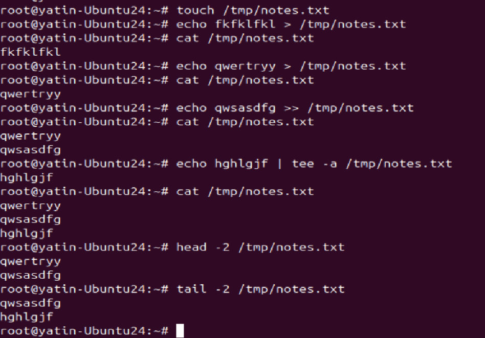

# Day 06 – Linux Fundamentals: Read and Write Text Files

## Task
This is a **continuation of Day 05**, but much simpler.

Today’s goal is to **practice basic file read/write** using only fundamental commands.

You will create a small text file and practice:
- Creating a file
- Writing text to a file
- Appending new lines
- Reading the file back

Keep it basic and repeatable.

---

## Guidelines
Follow these rules while creating your practice note:

- Create a file named `notes.txt`
- Write 3 lines into the file using **redirection** (`>` and `>>`)
- Use **`cat`** to read the full file
- Use **`head`** and **`tail`** to read parts of the file
- Use **`tee`** once to write and display at the same time
- Keep it short (8–12 lines total in the file)

Suggested command flow:
1. `touch notes.txt` - used to create a empty file
2. `echo "Line 1" > notes.txt` - to write text in file and replace file contents with new one
3. `echo "Line 2" >> notes.txt` - used to append new text in the file
4. `echo "Line 3" | tee -a notes.txt` - display and append the same text in file
5. `cat notes.txt` - display whole content of file
6. `head -n 2 notes.txt` - display top 2 lines of the file
7. `tail -n 2 notes.txt` - display last 2 lines of the file

---

## Resources
Use these docs to understand the commands:

- `touch` (create an empty file) 
- `cat` (read full file) 
- `head` and `tail` (read parts of a file) 
- `tee` (write and display at the same time)

---

## Why This Matters for DevOps
Reading and writing files is a daily task in DevOps.

Logs, configs, and scripts are all text files.  
If you can handle files quickly, you can debug and automate faster.

---

