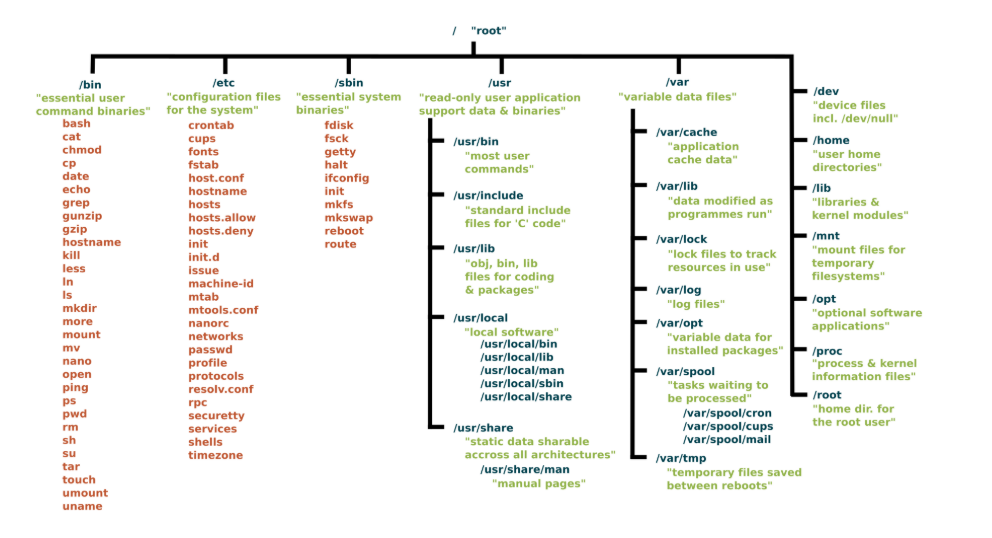
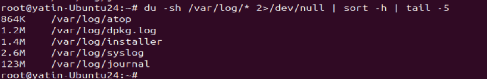
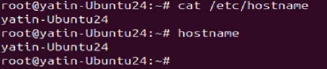
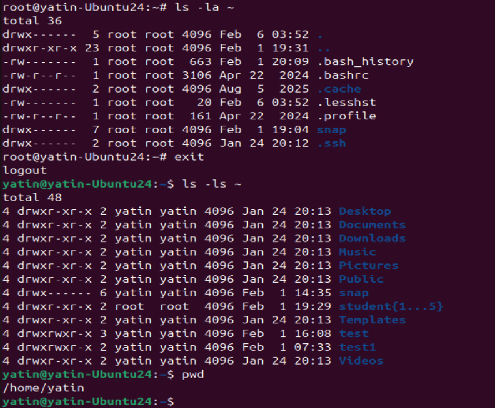
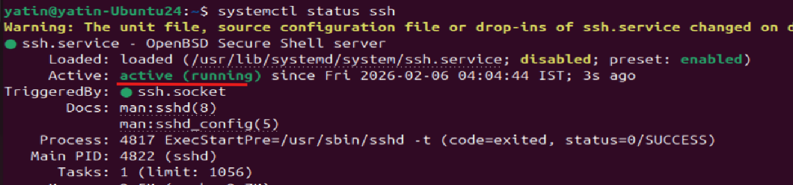
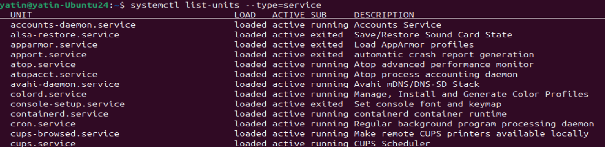
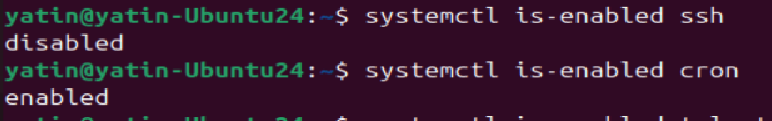
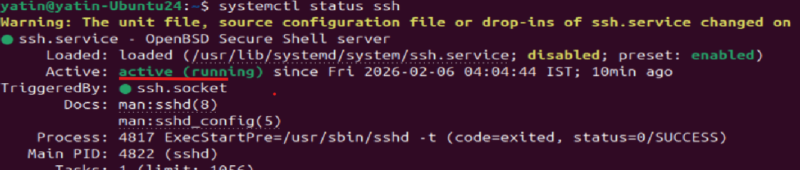
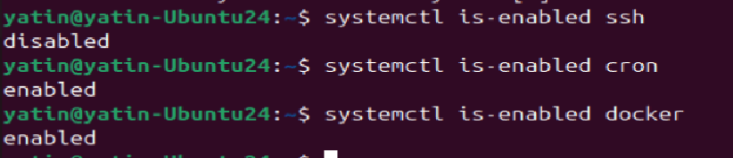
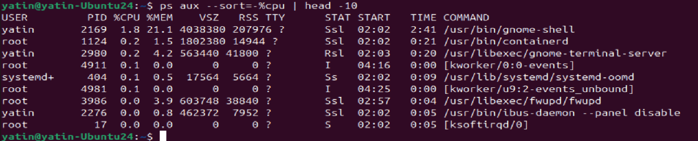

# Day 07 – Linux File System Hierarchy & Scenario-Based Practice

## Task
Today's goal is to **understand where things live in Linux** and **practice troubleshooting like a DevOps engineer**.

You will create notes covering:
- Linux File System Hierarchy (the most important directories)
- Practice solving real-world scenarios step by step

This consolidates your Linux fundamentals and prepares you for real-world troubleshooting.

---

## Guidelines

### Part 1: Linux File System Hierarchy (30 minutes)

Document the purpose of these **essential** directories:

**Core Directories (Must Know):**
- `/` (root) - The starting point of everything - master top node of Linux Filesystem from where everything starts, could be checked if any unwanted usage of this directory, that could cause system issue
- `/home` - User home directories - used for user file and scripts
- `/root` - Root user's home directory - used for root user files and scripts
- `/etc` - Configuration files - for linux OS - used for system service or configuration files, to change any behaviour
- `/var/log` - Log files (very important for DevOps!) - logs location for every process, system - used to check logs and issue with services
- `/tmp` - Temporary files - goes away as system reboot by default - used to store temp files during installation, scripts outputs etc.

**Additional Directories (Good to Know):**
- `/bin` - Essential command binaries - important system binaries line ls, cp , cat - used for boot and system repair issues
- `/usr/bin` - User command binaries - user binaries - used for user related commands
- `/opt` - Optional/third-party applications binaries



**Hands-on task:**

# Find the largest log file in /var/log
du -sh /var/log/* 2>/dev/null | sort -h | tail -5



du -sh /var/log/* listed disk space usage for each file and directory in path /var/log
then 2>/dev/null used to pass the same output on screen/monitor
sort -h sorted the output in humand readable format
tail -5 displayed only last 5 entries
this way You could find which file are using space on system

# Look at a config file in /etc
cat /etc/hostname



if you change this file it could impact server as it stores system hostname

# Check your home directory
ls -la ~



Display user home path list of files, 1st ran for root then 2nd with user


---

### Part 2: Scenario-Based Practice (40 minutes)

**Important:** Focus on understanding the **troubleshooting flow**, not memorizing commands. Use the hints!

---

#### SOLVED EXAMPLE: Understanding How to Approach Scenarios

**Example Scenario: Check if a service is running**

Question: How do you check if the 'ssh' service is running?


**My Solution (Step by step):**

**Step 1:** Check service status

systemctl status ssh




**Why this command?** It shows if the service is active, failed, or stopped

**Step 2:** If service is not found, list all services

systemctl list-units --type=service

list all services on system and its status



**Why this command?** To see what services exist on the system

**Step 3:** Check if service is enabled on boot

systemctl is-enabled ssh




**Why this command?** To know if it will start automatically after reboot

**What I learned:** Always check status first, then investigate based on what you see.

---

Now try these scenarios yourself:

---

**Scenario 1: Service Not Starting** 

A web application service called 'myapp' failed to start after a server reboot.
What commands would you run to diagnose the issue?
Write at least 4 commands in order.
1) check service active or inactive - systemctl status <servicename>


2) check service related logs for issue , when it stopped , then try to solve those issue - journalctl -u <servicename> -n 50 for only 50 last lines


ssh was stopped at 6 Feb 04:03 and then started at 04:04

3) try to start it manually if it fails then again check logs - systemctl start <servicename>
as above log shows it was started at 04:04

4) check if its enabled on boot with systemctl is-enabled <servicename>



**Hint:**
- First check: Is the service running or failed?
- Then check: What do the logs say?
- Finally check: Is it enabled to start on boot?

**Commands to explore:** `systemctl status myapp`, `systemctl is-enabled myapp`, `journalctl -u myapp -n 50`

**Resource:** Review Day 04 (Process and Services practice)

---

**Scenario 2: High CPU Usage** 
```
Your manager reports that the application server is slow.
You SSH into the server. What commands would you run to identify
which process is using high CPU?
```

**Hint:**
- Use a command that shows **live** CPU usage - top/htop
- Look for processes sorted by CPU percentage
- Note the PID (Process ID) of the top process

**Commands to explore:** `top` (press 'q' to quit), `htop`, `ps aux --sort=-%cpu | head -10`


**Resource:** Review Day 05 (Troubleshooting Drill - CPU & Memory section)

---

**Scenario 3: Finding Service Logs** 
```
A developer asks: "Where are the logs for the 'docker' service?"
The service is managed by systemd.
What commands would you use?
```

**Hint:**
- systemd services → logs are in journald
- Command pattern: `journalctl -u <service-name>`
- Use -n flag to limit number of lines
- Use -f flag to follow logs in real-time (like tail -f)

**Commands to explore:**

# Check service status first
systemctl status ssh

# View last 50 lines of logs
journalctl -u ssh -n 50

# Follow logs in real-time
journalctl -u ssh -f


**Resource:** Review Day 04 (Process and Services - Log checks section)

---

**Scenario 4: File Permissions Issue** 
```
A script at /home/user/backup.sh is not executing.
When you run it: ./backup.sh
You get: "Permission denied"

What commands would you use to fix this? - chmod
```

**Hint:**
- First: Check what permissions the file has
- Understand: Files need 'x' (execute) permission to run
- Fix: Add execute permission with chmod

**Step-by-step solution structure:**
```
Step 1: Check current permissions
Command: ls -l /home/user/backup.sh
Look for: -rw-r--r-- (notice no 'x' = not executable)

Step 2: Add execute permission
Command: chmod +x /home/user/backup.sh

Step 3: Verify it worked
Command: ls -l /home/user/backup.sh
Look for: -rwxr-xr-x (notice 'x' = executable)

Step 4: Try running it
Command: ./backup.sh
```

**Resource:** Review Day 02 (File Permissions and Users Management)

---

## Why This Matters for DevOps
Understanding the file system is critical for:
- Knowing where to find logs, configs, and binaries
- Troubleshooting deployment issues
- Writing automation scripts that work across systems

Scenario-based practice prepares you for:
- Real production incidents
- DevOps interviews
- On-call troubleshooting under pressure

These are questions you **will** face in interviews and during real incidents.

---
