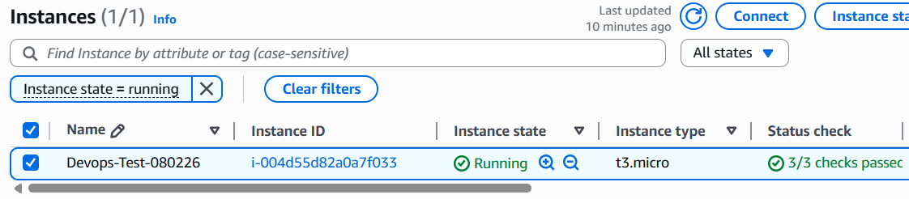
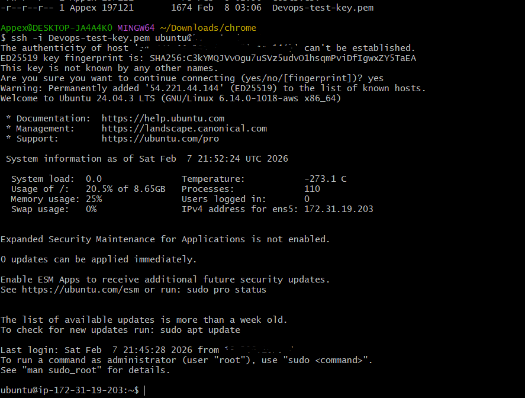
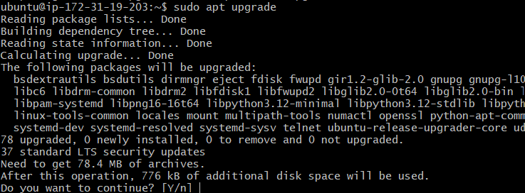
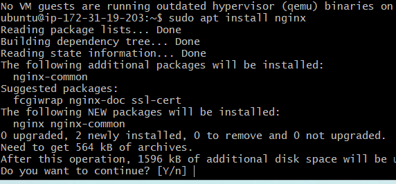
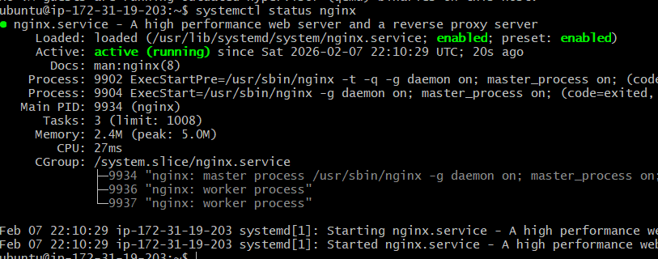
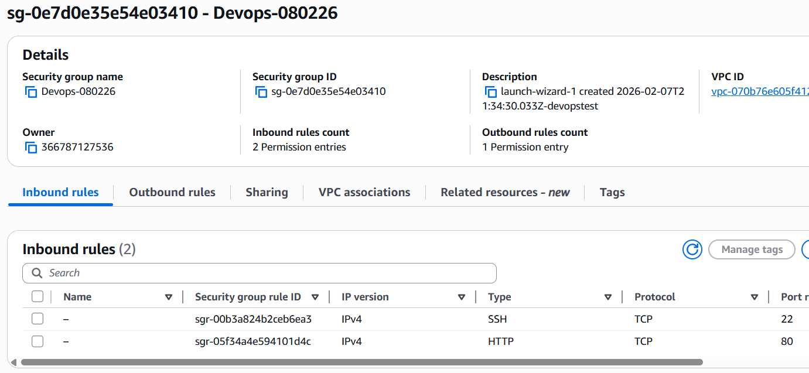
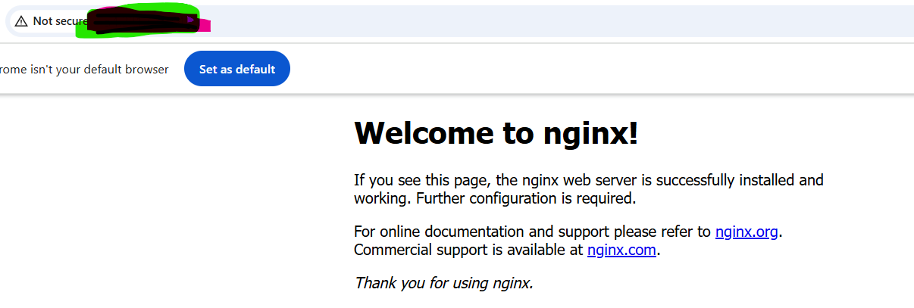
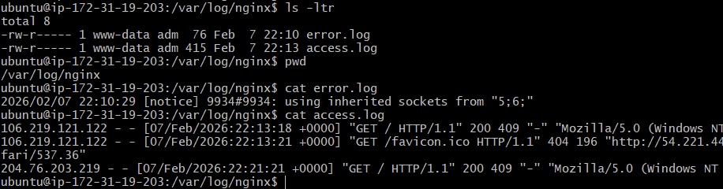
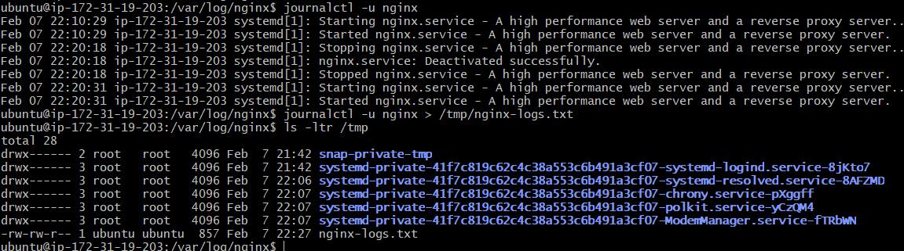
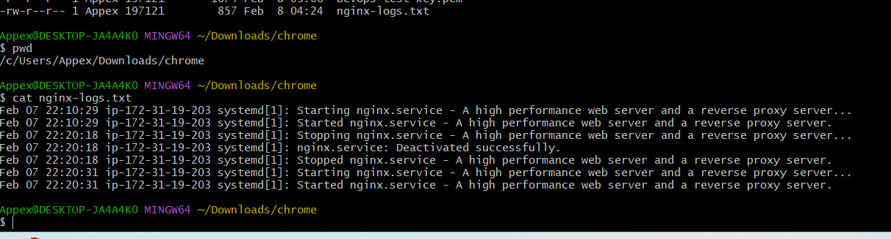

# Day 08 – Cloud Server Setup: Docker, Nginx & Web Deployment

## Task
Today's goal is to **deploy a real web server on the cloud** and learn practical server management.

You will:
- Launch a cloud instance (AWS EC2 or Utho)
- Connect via SSH
- Install Nginx
- Configure security groups for web access (port 80 by default for nginx)
- Extract and save logs to a file
- Verify your webpage is accessible from the internet

This is real DevOps work - exactly what you'll do in production.

---

## Expected Output
By the end of today, you should have:

1. A markdown file named: `day-08-cloud-deployment.md`
2. Screenshots showing:
   - SSH connection to your server
   - Nginx welcome page accessible from browser
   - Log file contents
3. The log file: `nginx-logs.txt`

---

## Prerequisites
- AWS account (Free Tier) OR Utho account
- Basic understanding of Linux commands (Days 1-7)
- SSH client (Terminal on Mac/Linux, PuTTY on Windows)

---

## Guidelines

### Part 1: Launch Cloud Instance & SSH Access (15 minutes)

**Step 1: Create a Cloud Instance**

Remember to enable public ip address allocation
ssh access from anywhere
key pair need to be created as you would access from ssh



**Step 2: Connect via SSH**
```bash
ssh -i <key file> ubuntu@<public-ip>
```


---

### Part 2: Install Docker & Nginx (20 minutes)

**Step 1: Update System**
```bash
sudo apt upgrade
```


**Step 3: Install Nginx**
```bash
sudo apt install docker.io
sudo apt install nginx
```


**Verify Nginx is running:**
```bash
systemctl status nginx
systemctl status docker
```


---

### Part 3: Security Group Configuration (10 minutes)

**Test Web Access:**
Open browser and visit: `http://<your-instance-ip>:80`

You should see the **Nginx welcome page**!

Need make sure Security Group have inbound rule access for port 80 from anywhere to access nginx on the server





---

### Part 4: Extract Nginx Logs (15 minutes)

**Step 1: View Nginx Logs**

nginx log location - /var/log/nginx



**Step 2: Save Logs to File**
```bash
journalctl -u nginx > /tmp/nginx-logs.txt
journalctl -u docker
```


**Step 3: Download Log File to Your Local Machine**
```bash
syntax:
scp [username]@[remote_host]:[remote_file_path] [local_destination_path]

scp -v -i <key file name with path> ubuntu@<public-ip>:/tmp/nginx-logs.txt .
. - for present location
-v - to display connection, transfer (progress of download). its useful when you have issue and to check where its failing.
-i - for authentication file name (path locally)
```



```bash
# On your local machine (new terminal window)
# For AWS:
scp -i your-key.pem ubuntu@<your-instance-ip>:~/nginx-logs.txt .

# For Utho:
scp root@<your-instance-ip>:~/nginx-logs.txt .
```

---


## Why This Matters for DevOps

This exercise teaches you:
- **Cloud infrastructure provisioning** - launching and configuring servers
- **Remote server management** - SSH, security, access control
- **Service deployment** - installing and running applications
- **Log management** - accessing and analyzing logs
- **Security** - configuring firewalls and security groups

These are core skills for any DevOps engineer working in production.

---