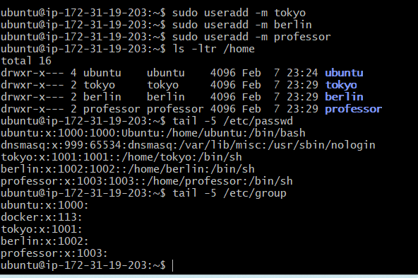
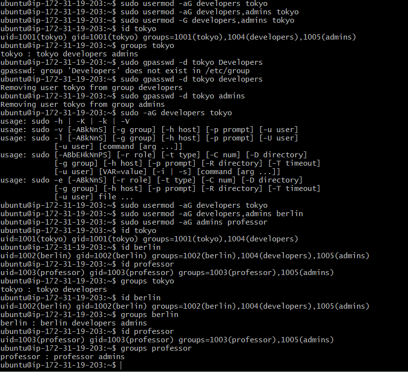
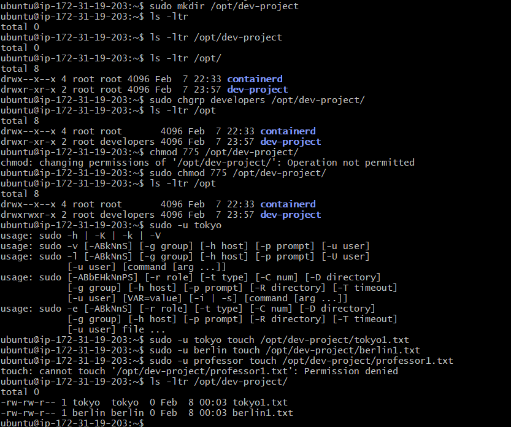
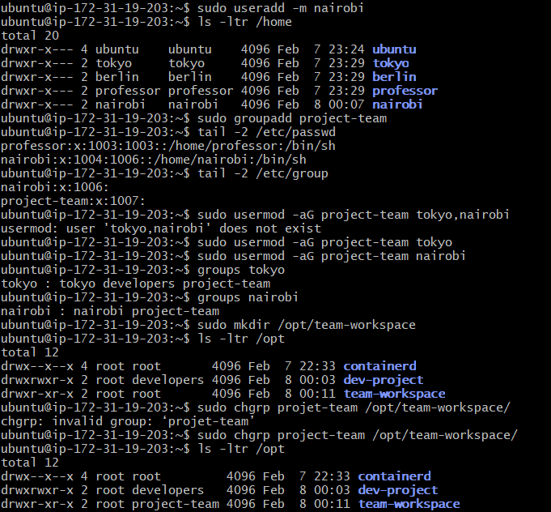
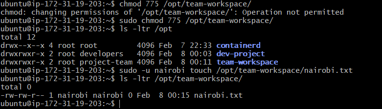

# Day 09 – Linux User & Group Management Challenge

## Task
Today's goal is to **practice user and group management** by completing hands-on challenges.

Figure out how to:
- Create users and set passwords
- Create groups and assign users
- Set up shared directories with group permissions

Use what you learned from Days 1-7 to find the right commands!

---

## Challenge Tasks

### Task 1: Create Users (20 minutes)

Create three users with home directories and passwords:
- `tokyo`
- `berlin`
- `professor`

**Verify:** Check `/etc/passwd` and `/home/` directory
```bash
useradd -m tokyo
useradd -m berlin
useradd -m professor
sudo passwd tokyo
sudo passwd berlin
sudo passwd professor
```


---

### Task 2: Create Groups (10 minutes)

Create two groups:
- `developers`
- `admins`

**Verify:** Check `/etc/group`
```bash
sudo groupadd developers
sudo groupadd admins
```

---

### Task 3: Assign to Groups (15 minutes)

Assign users:
- `tokyo` → `developers`
- `berlin` → `developers` + `admins` (both groups)
- `professor` → `admins`

**Verify:** Use appropriate command to check group membership

```bash
gpasswd -d <username> <groupname> - to delete user from group
usermod -aG <groupname> <username> - to add user to group
id <username> or groups <username> - to check user in which all groups
```


---

### Task 4: Shared Directory (20 minutes)

1. Create directory: `/opt/dev-project`
2. Set group owner to `developers`
3. Set permissions to `775` (rwxrwxr-x)
4. Test by creating files as `tokyo` and `berlin`

**Verify:** Check permissions and test file creation




---

### Task 5: Team Workspace (20 minutes)

1. Create user `nairobi` with home directory
2. Create group `project-team`
3. Add `nairobi` and `tokyo` to `project-team`
4. Create `/opt/team-workspace` directory
5. Set group to `project-team`, permissions to `775`
6. Test by creating file as `nairobi`



---

## Hints

**Stuck? Try these commands:**
- User: `useradd`, `passwd`, `usermod`
- Group: `groupadd`, `groups`
- Permissions: `chgrp`, `chmod`
- Test: `sudo -u username command`

**Tip:** Use `-m` flag with useradd for home directory, `-aG` for adding to groups

---

## Documentation

Create `day-09-user-management.md`:

```markdown
# Day 09 Challenge

## Users & Groups Created
- Users: tokyo, berlin, professor, nairobi
- Groups: developers, admins, project-team

## Group Assignments
[List who is in which groups]

## Directories Created
[List directories with permissions]

## Commands Used
[Your commands here]

## What I Learned
[3 key points]
```

---


## Troubleshooting

**Permission denied?** Use `sudo`

**User can't access directory?**
- Check group: `groups username`
- Check permissions: `ls -ld /path`

---