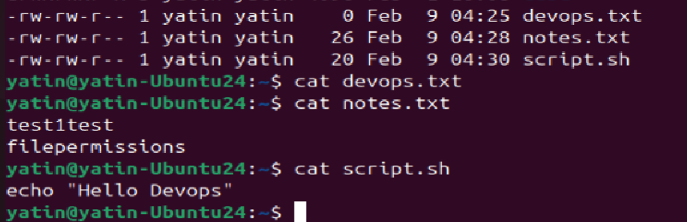
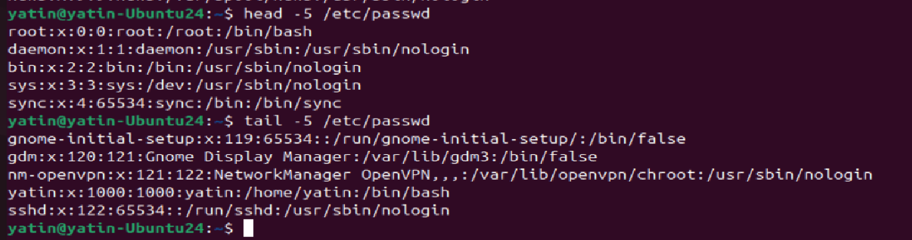
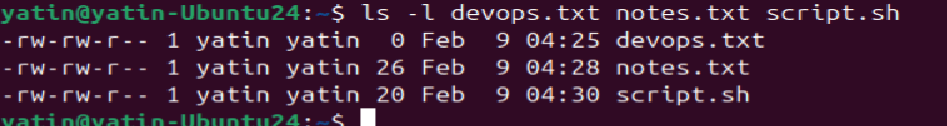
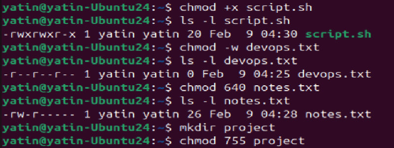
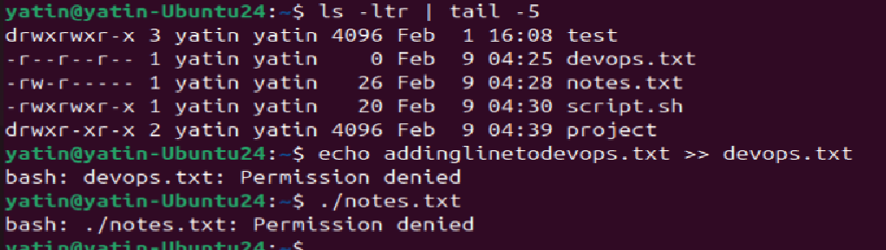

# Day 10 – File Permissions & File Operations Challenge

## Task
Master file permissions and basic file operations in Linux.

- Create and read files using `touch`, `cat`, `vim`
- Understand and modify permissions using `chmod`

---

## Challenge Tasks

### Task 1: Create Files (10 minutes)

1. Create empty file `devops.txt` using `touch`
2. Create `notes.txt` with some content using `cat` or `echo`
3. Create `script.sh` using `vim` with content: `echo "Hello DevOps"`

**Verify:** `ls -l` to see permissions

---

### Task 2: Read Files (10 minutes)

1. Read `notes.txt` using `cat`
2. View `script.sh` in vim read-only mode
3. Display first 5 lines of `/etc/passwd` using `head`
4. Display last 5 lines of `/etc/passwd` using `tail`

---

### Task 3: Understand Permissions (10 minutes)

Format: `rwxrwxrwx` (owner-group-others)
- `r` = read (4), `w` = write (2), `x` = execute (1)

Check your files: `ls -l devops.txt notes.txt script.sh`

Answer: What are current permissions? Who can read/write/execute?
Owner - yatin
Group - yatin
Owner and group have read and write permissions (rw-)
others have only read permission (r--)

---

### Task 4: Modify Permissions (20 minutes)

1. Make `script.sh` executable → run it with `./script.sh`
2. Set `devops.txt` to read-only (remove write for all)
3. Set `notes.txt` to `640` (owner: rw, group: r, others: none)
4. Create directory `project/` with permissions `755`

**Verify:** `ls -l` after each change

---

### Task 5: Test Permissions (10 minutes)

1. Try writing to a read-only file - what happens?
2. Try executing a file without execute permission
3. Document the error messages

Permission deny error for all those were no permission to write or execute:

---

## Hints

- Create: `touch`, `cat > file`, `vim file`
- Read: `cat`, `head -n`, `tail -n`
- Permissions: `chmod +x`, `chmod -w`, `chmod 755`

---