# Day 13 – Linux Volume Management (LVM)

## Task
Learn LVM to manage storage flexibly – create, extend, and mount volumes.

**Watch First:** [Linux LVM Tutorial](https://youtu.be/Evnf2AAt7FQ?si=ncnfQYySYtK_2K3c)

---

## Before You Start

Switch to root user:
```bash
sudo -i
```
or
```bash
sudo su
```
No spare disk? Create a virtual one (watch the tutorial):
```bash
dd if=/dev/zero of=/tmp/disk1.img bs=1M count=1024
losetup -fP /tmp/disk1.img
losetup -a   # Note the device name (e.g., /dev/loop0)
```

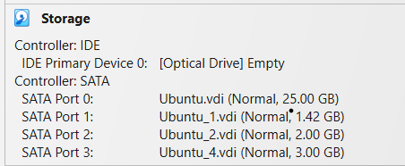
1.42GB created to be attached directly without lvm
2+3GB would be combined and attached via lvm

---

## Challenge Tasks

### Task 1: Check Current Storage
Run: `lsblk`, `pvs`, `vgs`, `lvs`, `df -h`

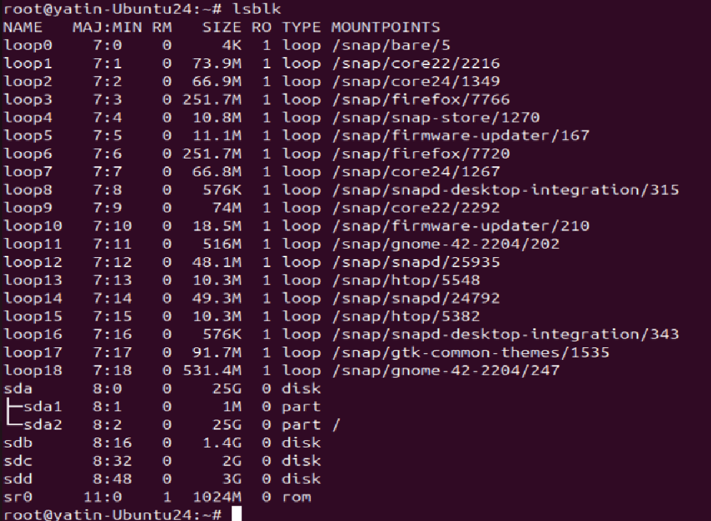

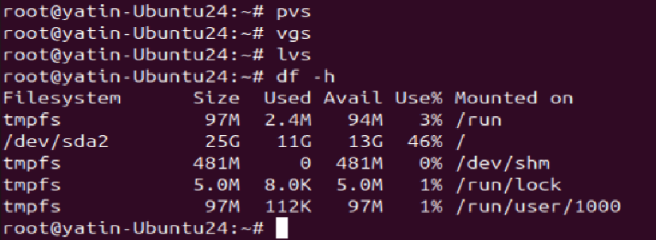


### Task 2: Create Physical Volume
```bash
pvcreate /dev/sdb   # or your loop device
pvs
```

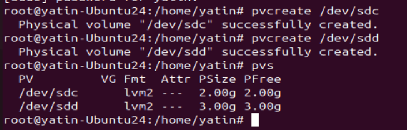


### Task 3: Create Volume Group
```bash
vgcreate devops-vg /dev/sdb
vgs
```
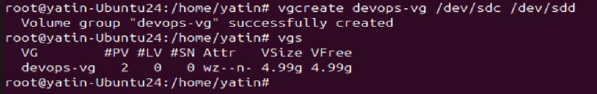

2 Physical Volume(PV) used to create 1 volume group and 0 logical volume(LV)

### Task 4: Create Logical Volume
```bash
lvcreate -L 500M -n app-data devops-vg
lvs
```


### Task 5: Format and Mount
```bash
mkfs.ext4 /dev/devops-vg/app-data
mkdir -p /mnt/app-data
mount /dev/devops-vg/app-data /mnt/app-data
df -h /mnt/app-data
```

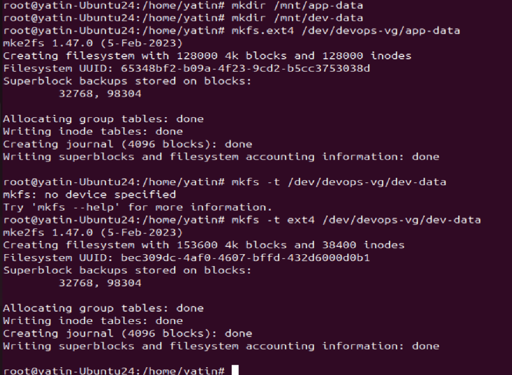

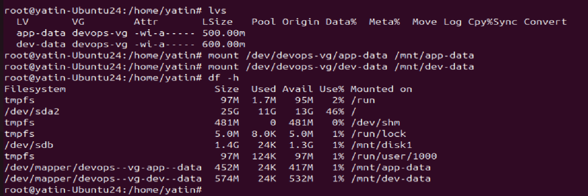

Below screenshot is to create mount point from single disk (no lvm usage)
1- make file system with mkfs
2- make directory in /mnt
3- mount the disk on that /mnt/ path
4- make /etc/fstab entry so it remain permanent after reboot or system too and does not get unmounted

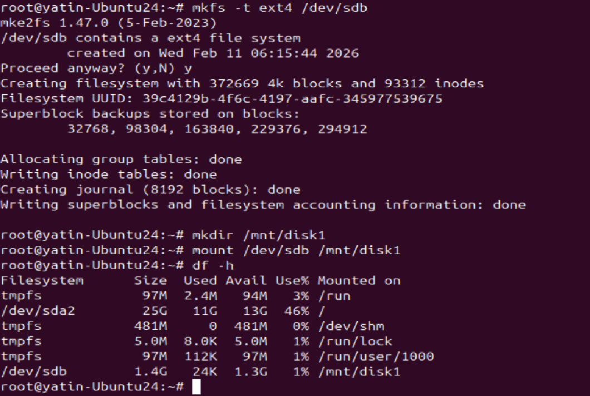

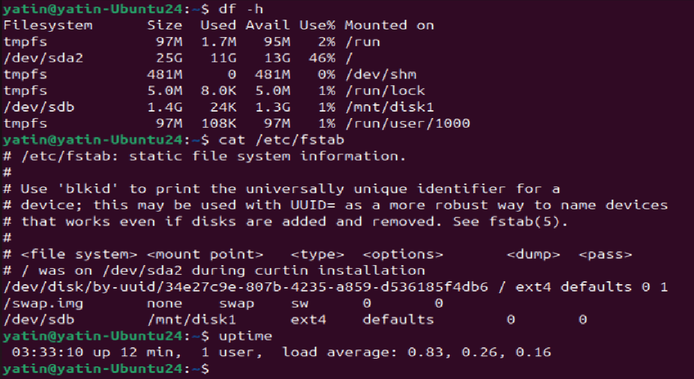


### Task 6: Extend the Volume
```bash
lvextend -L +200M /dev/devops-vg/app-data
resize2fs /dev/devops-vg/app-data
df -h /mnt/app-data
```

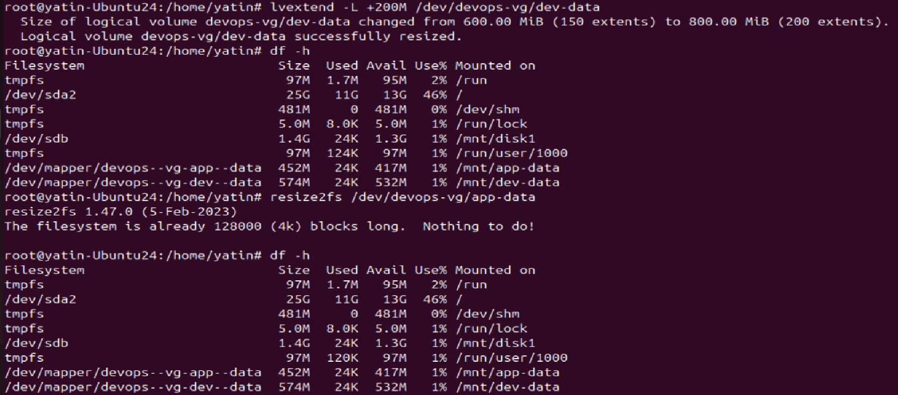

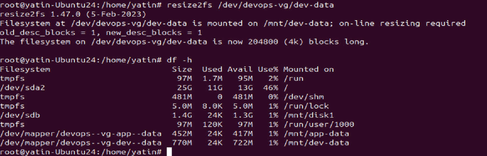

/mnt/dev-data filesystem is extended by 200MB

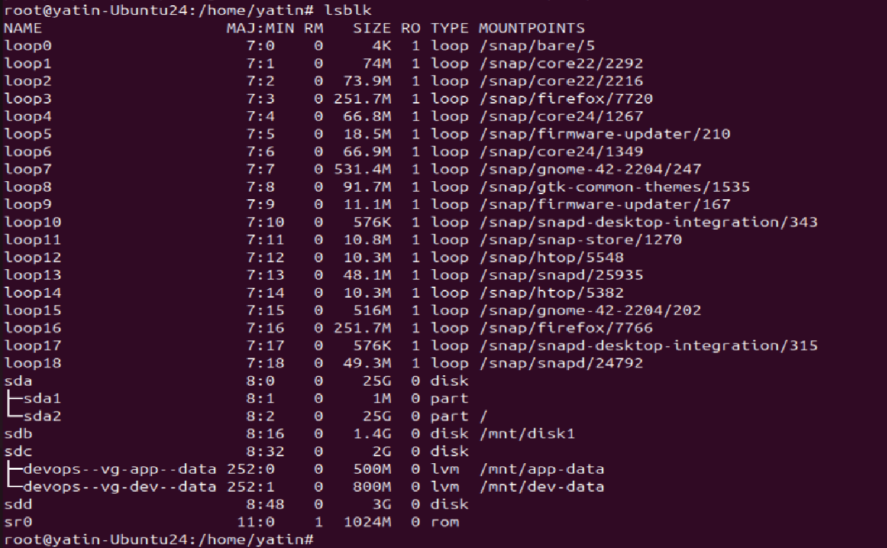

extending /mnt/app-data by 1GB

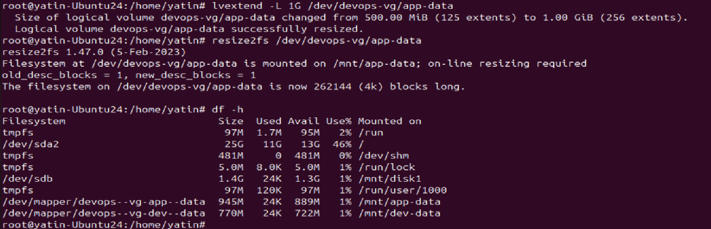

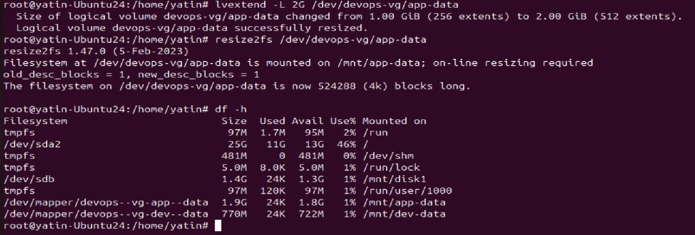

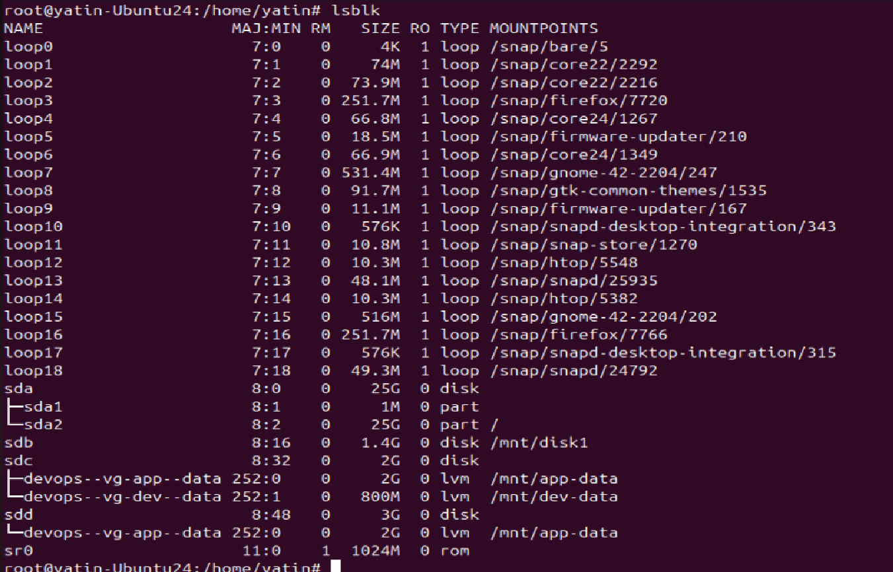
