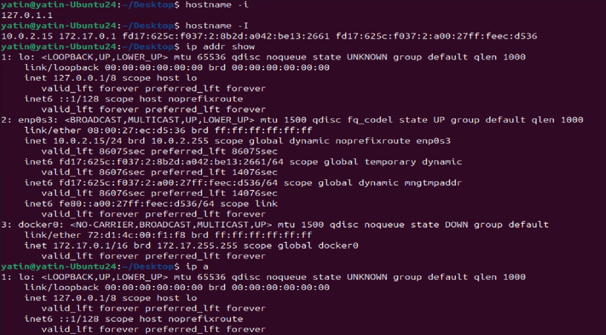
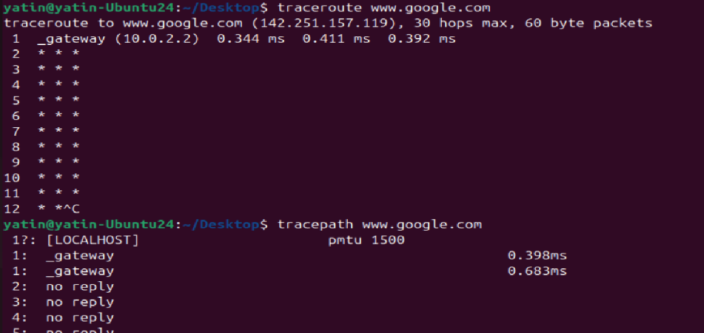
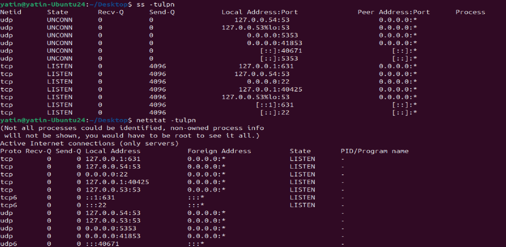
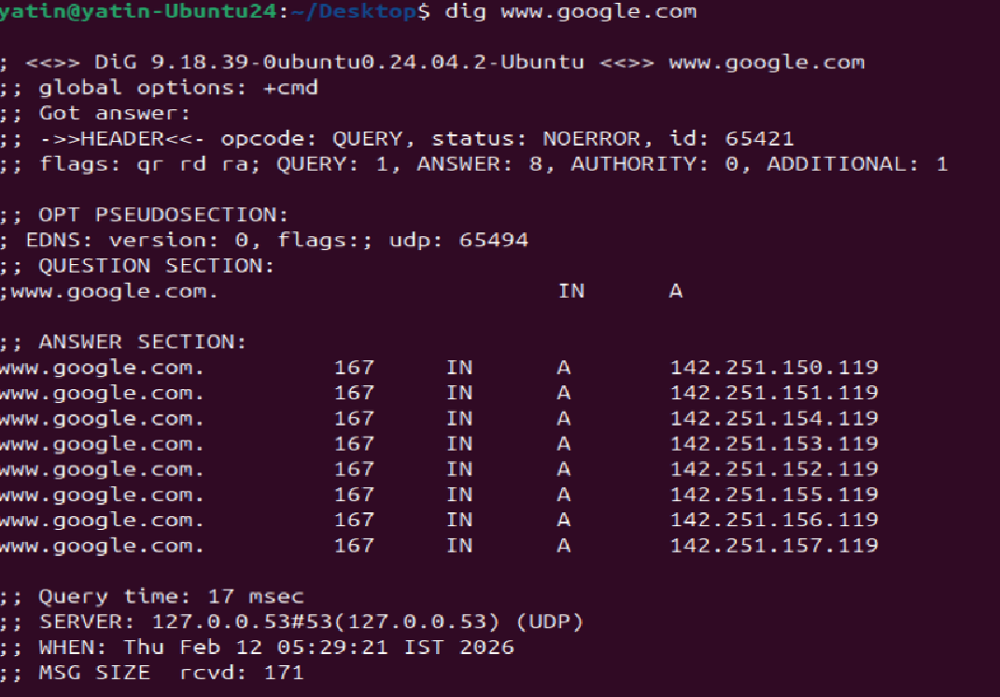
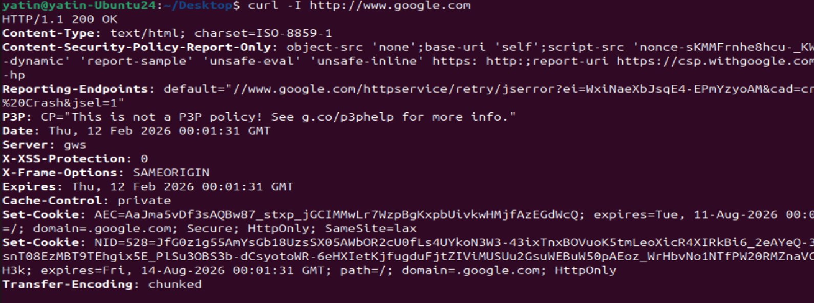
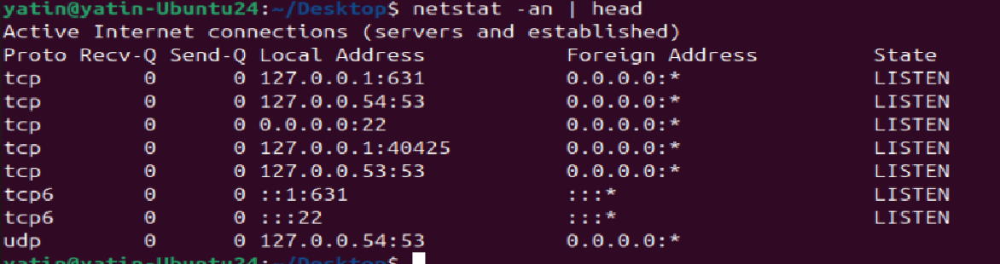
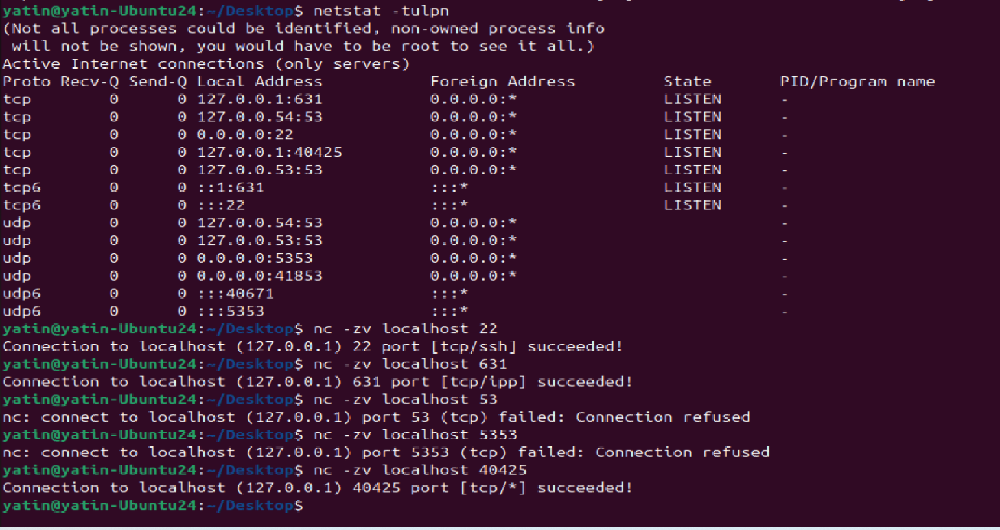

# Day 14 – Networking Fundamentals & Hands-on Checks

## Task
Get comfortable with core networking concepts and the commands you’ll actually run during troubleshooting.

You will:
- Map the **OSI vs TCP/IP models** in your own words
- Run essential connectivity commands
- Capture a mini network check for a target host/service

Keep it short, real, and repeatable.

```bash
OSI model - APSTNDP - 7 Layers

7- Application
6- Presentation
5- Session
4- Transport
3- Network
2- Data Link
1- Physical

Whereas TCP/IP Model - 4 Layers
4- Application - HTTP,FTP,DNS etc
3- Transport - TCP/UDP
2- Internet - IP
1- Link/physical

```
---


## Quick Concepts (write 1–2 bullets each)
- OSI layers (L1–L7) vs TCP/IP stack (Link, Internet, Transport, Application)
- Where **IP**, **TCP/UDP**, **HTTP/HTTPS**, **DNS** sit in the stack
- One real example: “`curl https://example.com` = App layer over TCP over IP”

---

## Hands-on Checklist (run these; add 1–2 line observations)
- **Identity:** `hostname -I` (or `ip addr show`) — note your IP. displays ip address of the system



- **Reachability:** `ping <target>` — mention latency and packet loss.


5 packets sent , no loss and latency is little high


- **Path:** `traceroute <target>` (or `tracepath`) — note any long hops/timeouts.




- **Ports:** `ss -tulpn` (or `netstat -tulpn`) — list one listening service and its port.



Displays listening port on the system

- **Name resolution:** `dig <domain>` or `nslookup <domain>` — record the resolved IP.




- **HTTP check:** `curl -I <http/https-url>` — note the HTTP status code. - 200 displayed confirms its reachable



- **Connections snapshot:** `netstat -an | head` — count ESTABLISHED vs LISTEN (rough).



Displays connected/established connections to system

Pick one target service/host (e.g., `google.com`, your lab server, or a local service) and stick to it for ping/traceroute/curl where possible.

---

## Mini Task: Port Probe & Interpret
1) Identify one listening port from `ss -tulpn` (e.g., SSH on 22 or a local web app).  
2) From the same machine, test it: `nc -zv localhost <port>` (or `curl -I http://localhost:<port>`).  
3) Write one line: is it reachable? If not, what’s the next check? (e.g., service status, firewall).



reachable for localhost (127.0.0.1) , not reachable for those which are not localhost

if issues in PROD, then check systemctl status , firewall or iptables issues etc

---

## Reflection (add to your markdown)
- Which command gives you the fastest signal when something is broken?

ping to check if reachable or not

traceroute to check where its broken

- What layer (OSI/TCP-IP) would you inspect next if DNS fails? If HTTP 500 shows up?

check app logs, ports listening or not


- Two follow-up checks you’d run in a real incident.
