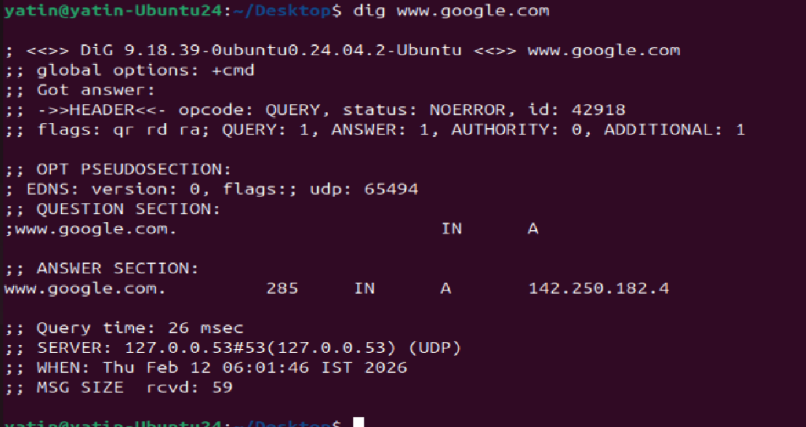
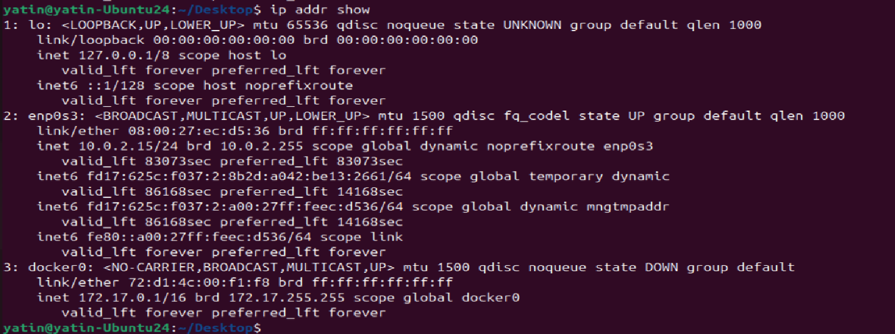
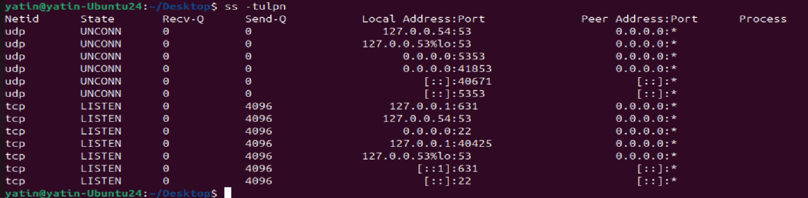

# Day 15 – Networking Concepts: DNS, IP, Subnets & Ports

## Task
Build on Day 14 by understanding the building blocks of networking every DevOps engineer must know.

You will:
- Understand how **DNS** resolves names to IPs
- Learn **IP addressing** (IPv4, public vs private)
- Break down **CIDR notation** and **subnetting** basics
- Know common **ports** and why they matter

This is concept-focused — research, understand, and document in your own words.

---

## Challenge Tasks

### Task 1: DNS – How Names Become IPs
1. Explain in 3–4 lines: what happens when you type `google.com` in a browser?

System 1st check locally if google.com exists or not, then move to default route to check what does google.com means, DNS resolve it into ip address of google.com. Then reachs that ip address and displays the information for that web page.

application layer talks to presentation layer to session establishment to transport layer (TCP) to network layer to data link and finally physical layer at browser side.

Opposites goes at google.com -  physical -> Data link -> Network -> Transport -> session -> presentation -> application

2. What are these record types? Write one line each:
   
   `A` - maps a hostname to IPv4 address

   `AAAA` - maps to hostname to IPv6 address

   `CNAME`- (Canonical) - Maps alias name to true (Canonical) name
   
   `MX`- (Mail exchanger)  - Directs email to proper mail server
   
   `NS`- (Name Server) - Delegates domain/subdomain to a specific set of authoritive name servers

3. Run: `dig google.com` — identify the A record and TTL from the output

A record - 142.250.182.4
TTL - 285

---

### Task 2: IP Addressing
1. What is an IPv4 address? How is it structured? (e.g., `192.168.1.10`)

Its 32 bit address of system. 
Structure - 8bit.8bit.8bit.8bit - 0.0.0.0 = 00000000.00000000.00000000.00000000

2. Difference between **public** and **private** IPs — give one example of each

public ip - are those ip address used to talk to internel/external world, without this you could not talk to internet, you could use whatsmyip to check your public ip

private IP - are internal for office, or system to system talking without DC, LAN etc , you could use ip a command to check private ip.

3. What are the private IP ranges?
   - `10.x.x.x`, `172.16.x.x – 172.31.x.x`, `192.168.x.x`

   range been defined for private ip as above as standard in world
   10.0.0.0 to 10.255.255.255

   172.16.0.0 to 172.31.255.255

   192.168.0.0 to 192.168.255.255

4. Run: `ip addr show` — identify which of your IPs are private

10.0.2.15 is private ip

---

### Task 3: CIDR & Subnetting
1. What does `/24` mean in `192.168.1.0/24`?

/24 is CIDR (Classless Inter-Domain Routing) format to denote ip address to better utilize them

192.168.1.0/24 - means it has network bit of 24 and host ID of 8 bits (32-24)

2. How many usable hosts in a `/24`? A `/16`? A `/28`?

/24 - 2^8-2 = 256-2 = 254

/16 - 2^16-2 = 65536-2 = 65534

/28 - 2^4-2 = 16-2 = 14

3. Explain in your own words: why do we subnet?

to effectively utilize the ip address else we would be running out of ip address in this interconnected world.

dividing the network in smaller part

better security

traffic control or network isolation

4. Quick exercise — fill in:

| CIDR | Subnet Mask    | Total IPs | Usable Hosts |
|------|-------------   |-----------|--------------|
| /24  |255.255.255.0   | 256       | 254          |
| /16  |255.255.0.0     | 65536     | 65534        |
| /28  |255.255.255.240 | 16        | 14           |

---

### Task 4: Ports – The Doors to Services
1. What is a port? Why do we need them?

port are doors throw which data flows or communicate with another host

a server could host multiple services (ftp, ssh, etc) those all talk to another server/client on particular port so they understnad each other words.

2. Document these common ports:

| Port | Service |
|------|---------|
| 22   | ssh     |
| 80   | http    |
| 443  | https   |
| 53   | dns     |
| 3306 | mysql   |
| 6379 | redis   |
| 27017| mongoDB |

3. Run `ss -tulpn` — match at least 2 listening ports to their services

53 - DNS
22 - SSH

---

### Task 5: Putting It Together
Answer in 2–3 lines each:
- You run `curl http://myapp.com:8080` — what networking concepts from today are involved?

DNS resolution for myapp.com and port 8080

- Your app can't reach a database at `10.0.1.50:3306` — what would you check first?

is port listening or not (netstat -an) on my system, then ping, then server side.
---