# Day 16 – Shell Scripting Basics

## Task
Start your shell scripting journey — learn the fundamentals every script needs.

You will:
- Understand **shebang** (`#!/bin/bash`) and why it matters
- Work with **variables**, **echo**, and **read**
- Write basic **if-else** conditions

---

## Challenge Tasks

### Task 1: Your First Script
1. Create a file `hello.sh`
2. Add the shebang line `#!/bin/bash` at the top
3. Print `Hello, DevOps!` using `echo`
4. Make it executable and run it

```bash
chmod +x hello.sh
./hello.sh
```

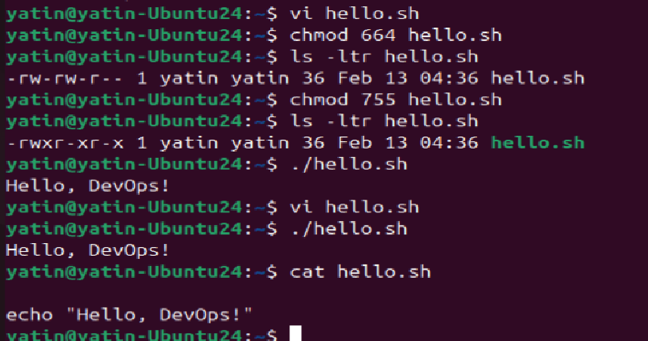


**Document:** What happens if you remove the shebang line?

script would be executed in default user's shell

---

### Task 2: Variables
1. Create `variables.sh` with:
   - A variable for your `NAME`
   - A variable for your `ROLE` (e.g., "DevOps Engineer")
   - Print: `Hello, I am <NAME> and I am a <ROLE>`
2. Try using single quotes vs double quotes — what's the difference?

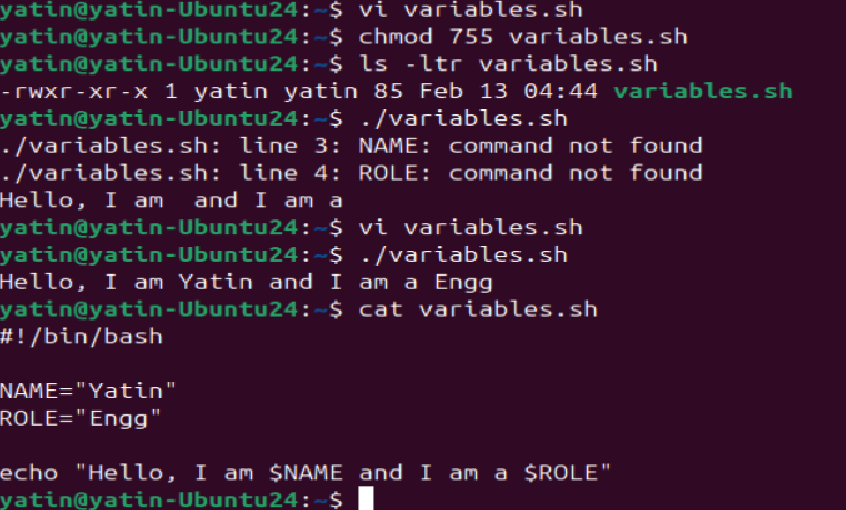

Avoid spaces during variable declaration, else it would result in failure as above.

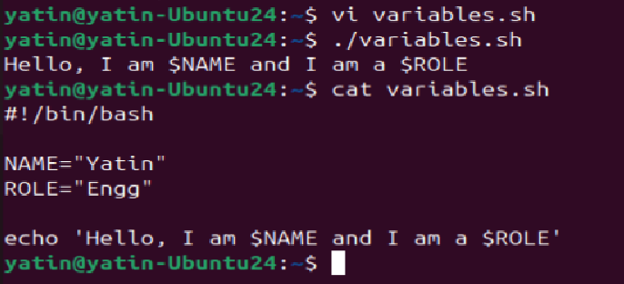

echo with ' resulted in line as it does not recognises the variables.

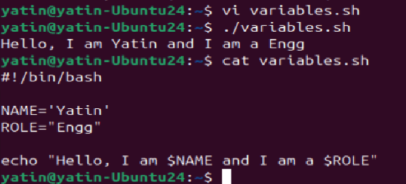

single quote or double quotes in variable declaration does not have any difference but in echo has in single quote it does not take/recognises it as variable.

---

### Task 3: User Input with read
1. Create `greet.sh` that:
   - Asks the user for their name using `read`
   - Asks for their favourite tool
   - Prints: `Hello <name>, your favourite tool is <tool>`


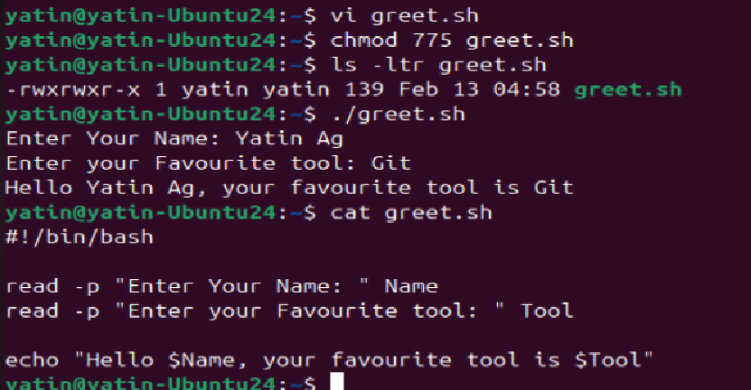

---

### Task 4: If-Else Conditions
1. Create `check_number.sh` that:
   - Takes a number using `read`
   - Prints whether it is **positive**, **negative**, or **zero**

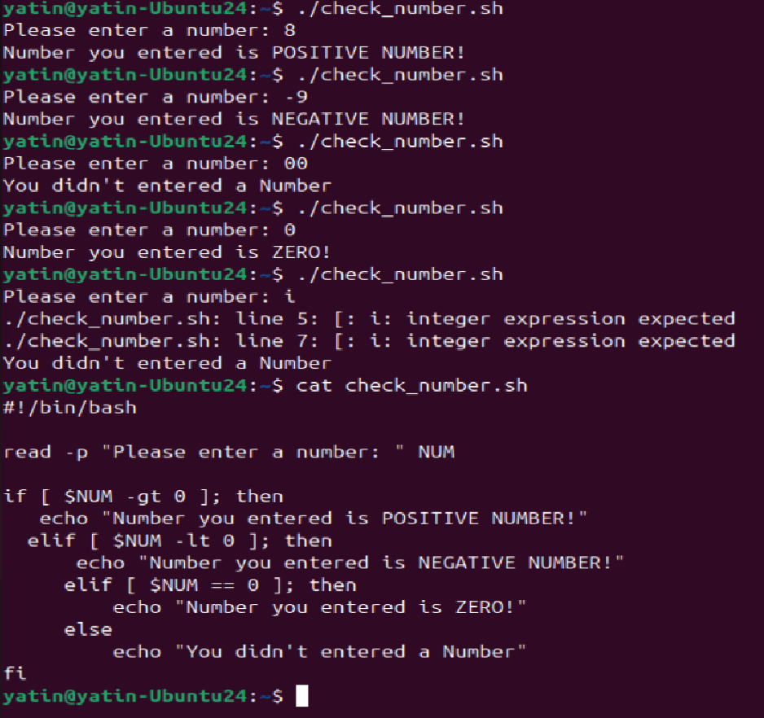


2. Create `file_check.sh` that:
   - Asks for a filename
   - Checks if the file **exists** using `-f`
   - Prints appropriate message

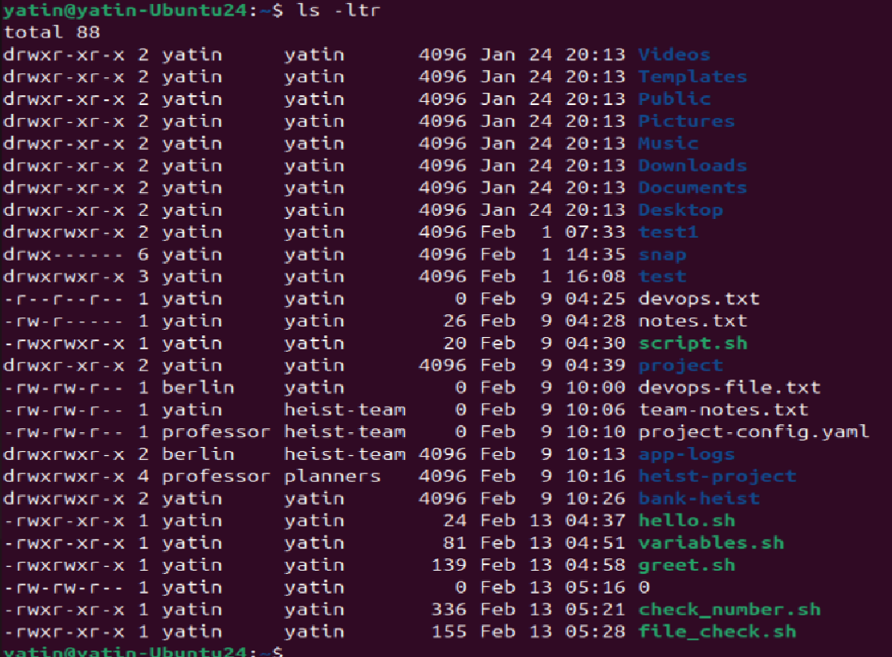

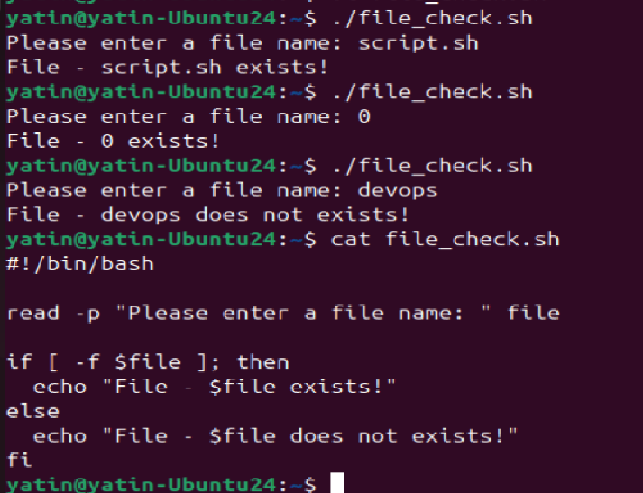

---

### Task 5: Combine It All
Create `server_check.sh` that:
1. Stores a service name in a variable (e.g., `nginx`, `sshd`)
2. Asks the user: "Do you want to check the status? (y/n)"
3. If `y` — runs `systemctl status <service>` and prints whether it's **active** or **not**
4. If `n` — prints "Skipped."

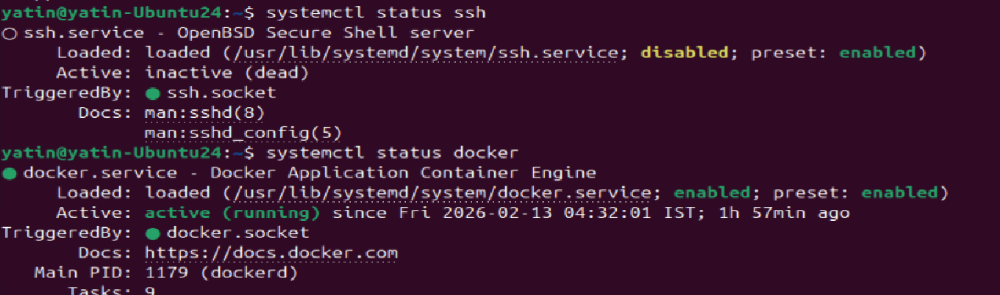

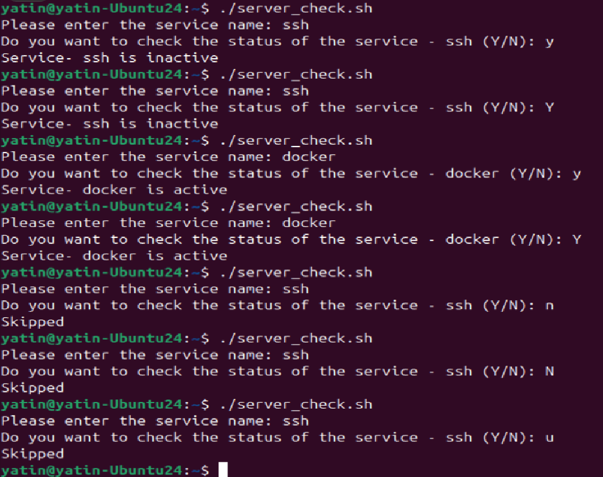

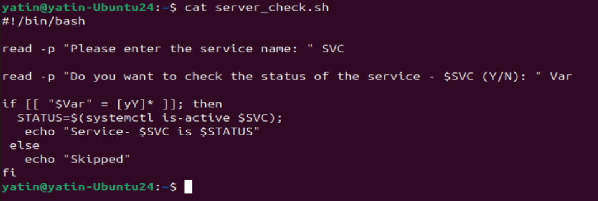

variable need to be in double quote and constant value need to be in single quote
new method to check y or Y 

more logical script

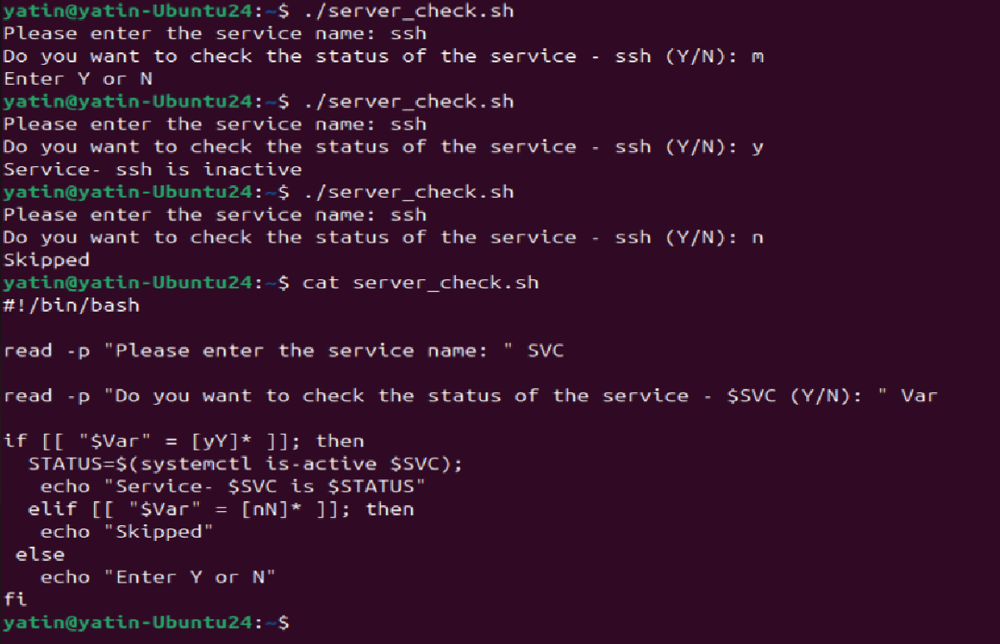
---

## Hints
- Shebang: `#!/bin/bash` tells the system which interpreter to use
- Variables: `NAME="Shubham"` (no spaces around `=`)
- Read: `read -p "Enter name: " NAME`
- If syntax: `if [ condition ]; then ... elif ... else ... fi`
- File check: `if [ -f filename ]; then`

---


