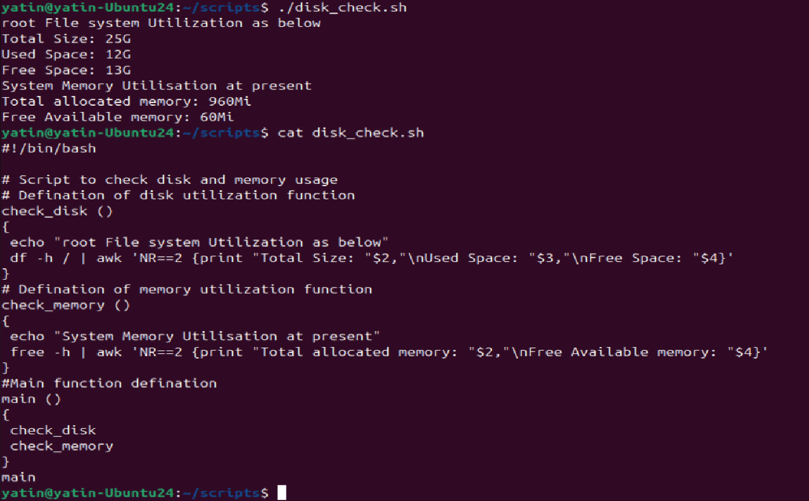

# Day 18 – Shell Scripting: Functions & Slightly Advanced Concepts

## Task
Write cleaner, reusable scripts — learn functions, strict mode, and real-world patterns.

You will:
- Write and call **functions**
- Use **`set -euo pipefail`** for safer scripts
- Work with **return values** and **local variables**
- Build a slightly advanced script

---

## Challenge Tasks

### Task 1: Basic Functions
1. Create `functions.sh` with:
   - A function `greet` that takes a name as argument and prints `Hello, <name>!`
   - A function `add` that takes two numbers and prints their sum
   - Call both functions from the script

Script called with arguments
Those arguments are input for the function and observe how arguments changes value when function been called

---

### Task 2: Functions with Return Values
1. Create `disk_check.sh` with:
   - A function `check_disk` that checks disk usage of `/` using `df -h`
   - A function `check_memory` that checks free memory using `free -h`
   - A main section that calls both and prints the results

Nesting of functions via main()
Usage of awk , how we could use this prowerful tool/command in script

---

### Task 3: Strict Mode — `set -euo pipefail`
1. Create `strict_demo.sh` with `set -euo pipefail` at the top
2. Try using an **undefined variable** — what happens with `set -u`?
3. Try a command that **fails** — what happens with `set -e`?
4. Try a **piped command** where one part fails — what happens with `set -o pipefail`?

**Document:** What does each flag do?
- `set -e` → Script exits if any command fails
- `set -u` → script exits if try to use a variable which is not defined
- `set -o pipefail` → if any piped commands either 1 or 2 fails example - (command1| command2) , its considered failure for whole line

---

### Task 4: Local Variables
1. Create `local_demo.sh` with:
   - A function that uses `local` keyword for variables
   - Show that `local` variables don't leak outside the function
   - Compare with a function that uses regular variables

---

### Task 5: Build a Script — System Info Reporter
Create `system_info.sh` that uses functions for everything:
1. A function to print **hostname and OS info**
2. A function to print **uptime**
3. A function to print **disk usage** (top 5 by size)
4. A function to print **memory usage**
5. A function to print **top 5 CPU-consuming processes**
6. A `main` function that calls all of the above with section headers
7. Use `set -euo pipefail` at the top

Output should look clean and readable.

---

## Hints
- Function syntax: `function_name() { ... }`
- Local vars: `local MY_VAR="value"`
- Strict mode: `set -euo pipefail` as first line after shebang
- Pass args to functions: `greet "Shubham"` → access as `$1` inside
- `$?` gives the exit code of last command

---

## Documentation

Create `day-18-scripting.md` with:
- Each script's code and output
- Explanation of `set -euo pipefail`
- What you learned (3 key points)

---
