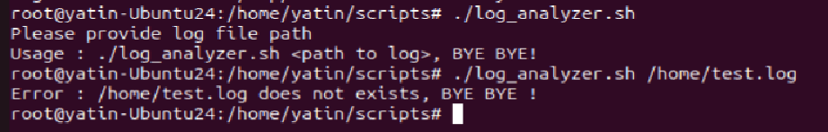
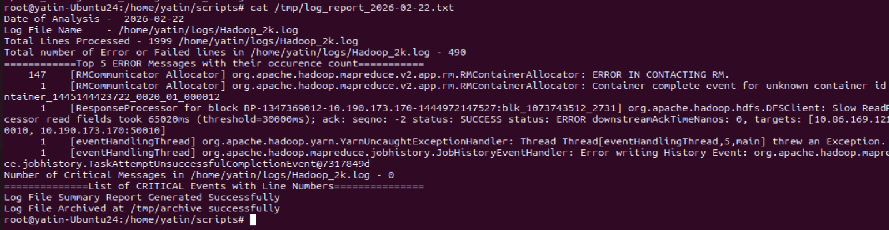
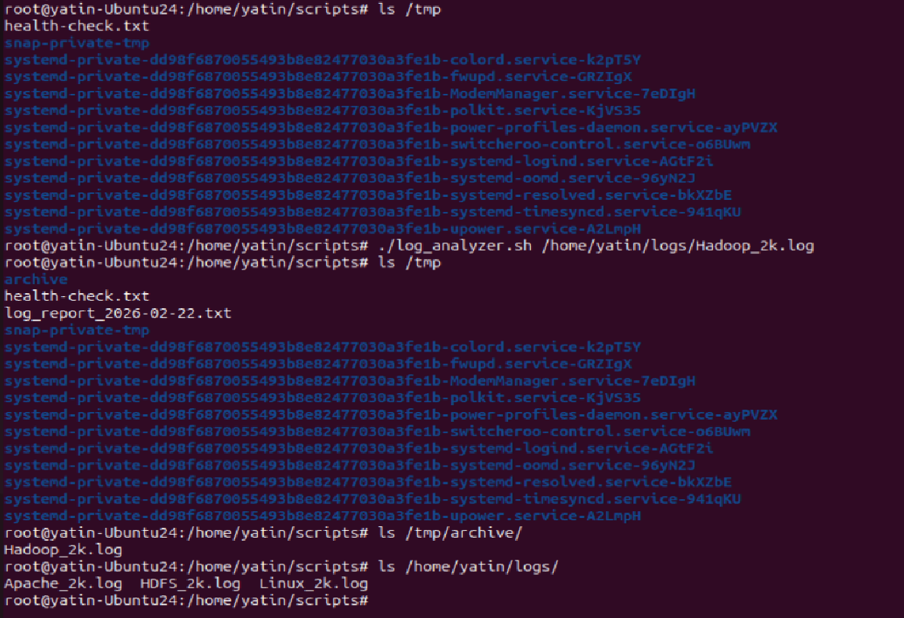
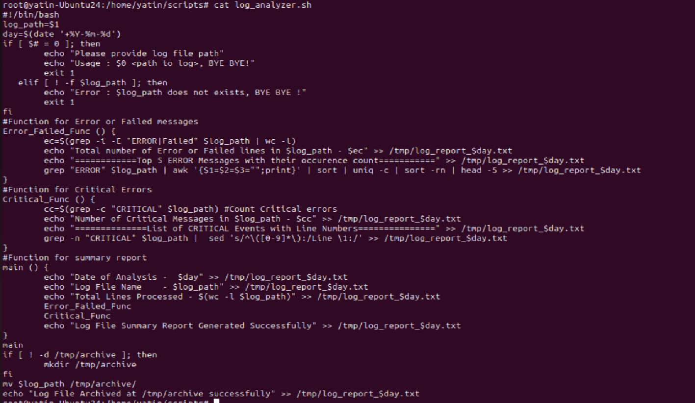

# Day 20 – Bash Scripting Challenge: Log Analyzer and Report Generator

## Task

You are a system administrator responsible for managing a network of servers. Every day, a log file is generated on each server containing important system events and error messages. Your job is to analyze these log files, identify specific events, and generate a summary report.

Write a Bash script (`log_analyzer.sh`) that automates the process of analyzing log files and generating a daily summary report.

---

## Challenge Tasks

### Task 1: Input and Validation
Your script should:
1. Accept the path to a log file as a command-line argument
2. Exit with a clear error message if no argument is provided
3. Exit with a clear error message if the file doesn't exist

Output of failure or check before processing the log file:


---

### Task 2: Error Count
1. Count the total number of lines containing the keyword `ERROR` or `Failed`
2. Print the total error count to the console

Function been written for ERROR findings and Output saved to log_report file as below screenshot

---

### Task 3: Critical Events
1. Search for lines containing the keyword `CRITICAL`
2. Print those lines along with their line number

Example output:
```
--- Critical Events ---
Line 84: 2025-07-29 10:15:23 CRITICAL Disk space below threshold
Line 217: 2025-07-29 14:32:01 CRITICAL Database connection lost
```

Function Critical been written and output saved to the log_report file as below screenshot

---

### Task 4: Top Error Messages
1. Extract all lines containing `ERROR`
2. Identify the **top 5 most common** error messages
3. Display them with their occurrence count, sorted in descending order

Example output:
```
--- Top 5 Error Messages ---
45 Connection timed out
32 File not found
28 Permission denied
15 Disk I/O error
9  Out of memory
```

Function for ERROR is processing it.

---

### Task 5: Summary Report
Generate a summary report to a text file named `log_report_<date>.txt` (e.g., `log_report_2026-02-11.txt`). The report should include:
1. Date of analysis
2. Log file name
3. Total lines processed
4. Total error count
5. Top 5 error messages with their occurrence count
6. List of critical events with line numbers

Output of Summary Report:


---

### Task 6 (Optional): Archive Processed Logs
Add a feature to:
1. Create an `archive/` directory if it doesn't exist
2. Move the processed log file into `archive/` after analysis
3. Print a confirmation message

Archive of log file after processing


---


Script log_analyzer.sh



### Learning
- How to break task into smaller tasks or functions and achieve the desired result.
- Use of grep, awk, sort, uniq, wc, sed etc.
- How to validate inputs and handle errors before processing it.
- Writing structured summary report output.