# Day 22 – Introduction to Git: Your First Repository

Git is the backbone of modern DevOps — every tool, pipeline, and workflow revolves around version control. Before diving into advanced concepts, you need to get comfortable with the basics by doing.

- Understand what Git is and why it matters
- Set up first Git repository from scratch
- Start building a living document of Git commands

---

GIT - Global Information Tracker

### Task 1: Install and Configure Git
1. Verify Git is installed on your machine

- 3 commands used to verify if git installed as shown below (git --version is easy and fasted to give result)

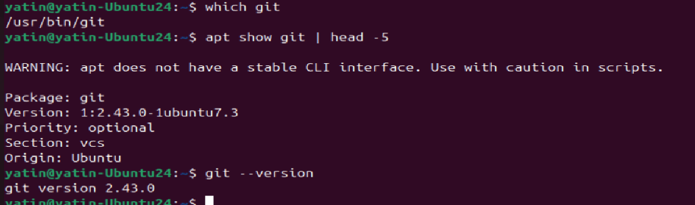

- By default git is installed in Linux but for Windows we need to install git bash and then use it
- You could install git on Linux via CLI too if not present
- update the system - apt update && apt install git
- Check this link for installation - https://blog.amitabh.cloud/installing-and-configuring-git

2. Set up your Git identity — name and email

To setup local identity for particular project:
`git config user.name "user name"`
`git config user.email "user emailid"`

To setup global identity:
`git config --global user.name "username"`
`git config --global user.email "user emailid"`

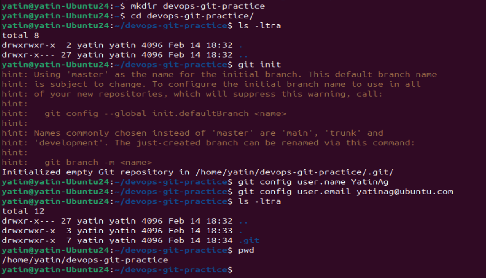

- As above we created a directory name "devops-git-practice" (Called a git repo - local) and initialized git repo in it via `git init`
- That created .git (hidden) file where version control system (VCS) for git been kept. IMPORTANT STUFF
- then setup user name and email id information for git, this would be used to know as version of file / folder get updated in git.

3. Verify your configuration

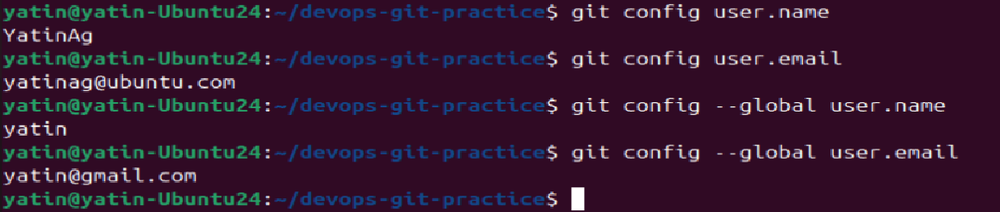

- As above we could see local user.name and emailid for git repo - devops-git-practice
- Also global user.name and email also listed via command which is for server name yatin-Ubuntu24

---

### Task 2: Create Your Git Project
1. Create a new folder called `devops-git-practice`
2. Initialize it as a Git repository
3. Check the status — read and understand what Git is telling you
4. Explore the hidden `.git/` directory — look at what's inside

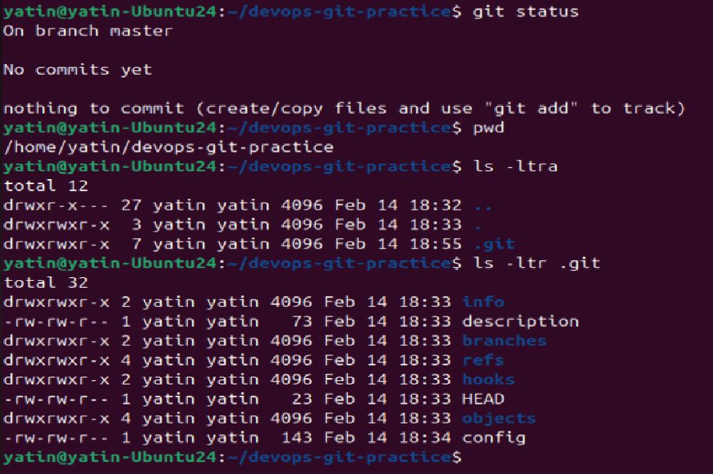

`git status` - gives working branch and other files in git repo which are present in various stages in git repo as commit of those file progress.

`.git/` - folder has various folders and files related to git repo
it contains configuration file, header file, description of repo, branches folders etc

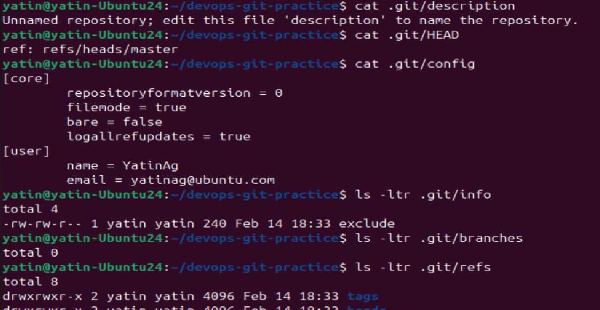

---

### Task 3: Create Your Git Commands Reference
1. Create a file called `git-commands.md` inside the repo
2. Add the Git commands you've used so far, organized by category:
   - **Setup & Config**
   - **Basic Workflow**
   - **Viewing Changes**
3. For each command, write:
   - What it does (1 line)
   - An example of how to use it

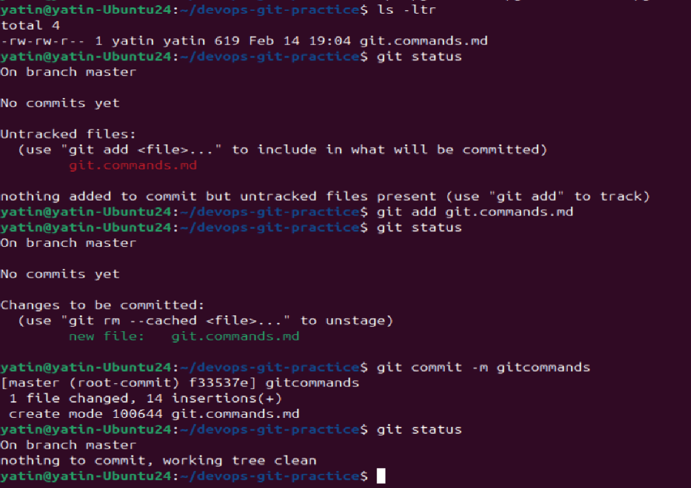

As above we first created a file then checked it's status in git, which reported it as untracked file

then we added it, then file moved to staged state

and finally we committed it were its been tracked in git repo now.

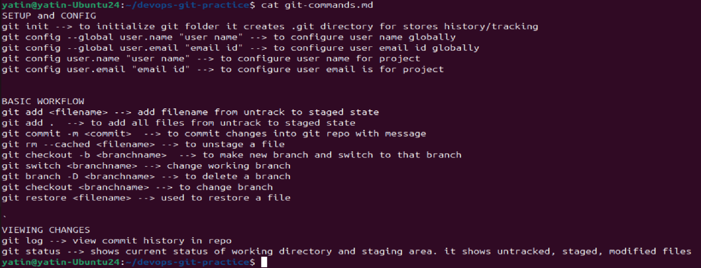

---

### Task 4: Stage and Commit
1. Stage your file
2. Check what's staged
3. Commit with a meaningful message
4. View your commit history

As file are moved from `untracked --> Staged --> Tracked` as we execute `git add`, `git commit` commands above with `git status` output in each step to show the progress.

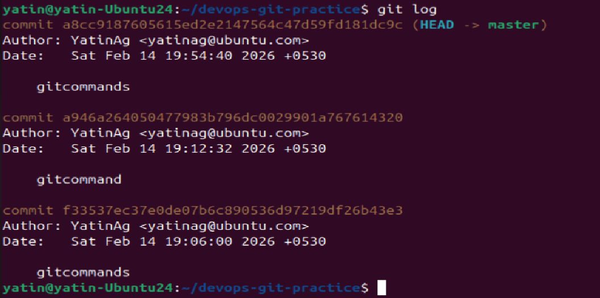

We observe commit been done at master/main branch by YatinAg with emailid of user , timestamp and commit message.

---

### Task 5: Make More Changes and Build History
1. Edit `git-commands.md` — add more commands as you discover them
2. Check what changed since your last commit 

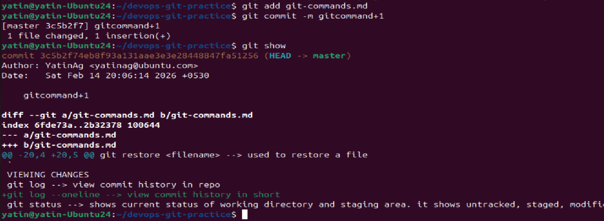

`git show` - gives output of changes done to the file as compared to previous commit (Green line is addition `git log --oneline`)

3. Stage and commit again with a different, descriptive message
4. Repeat this process at least **3 times** so you have multiple commits in your history
5. View the full history in a compact format

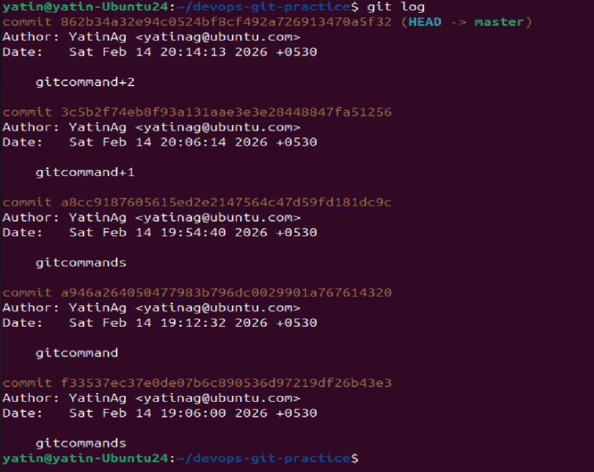

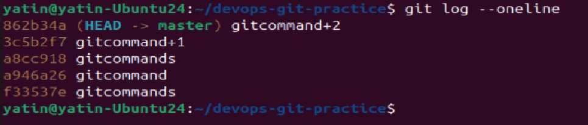

---

### Task 6: Understand the Git Workflow
1. What is the difference between `git add` and `git commit`?

`git add` - put file from untracking to stage state in git repo, until we perform git add its like a file in File system which could not be restored if removed
`git commit` - put the file from staged to tracking state

2. What does the **staging area** do? Why doesn't Git just commit directly?

To prevent additional commit in PROD

3. What information does `git log` show you?

It shows git commit history with HASH information for each commit, author name and emailid who made changes and timestamp when that commit made.

4. What is the `.git/` folder and what happens if you delete it?

Its centralised system where all commit, branch, project details etc been stored, if its delete then all these history is gone and making that folder as normal folder without VCS (Version Control System)

5. What is the difference between a **working directory**, **staging area**, and **repository**?

Working Directory - is branch in which user working and making changes.
staging area - is temporary area where user move file before commit in repo
repository - is where we hold the VCS for the folder.

---

