# Day 23 – Git Branching & Working with GitHub

---

## Challenge Tasks

### Task 1: Understanding Branches
1. What is a branch in Git?

Its a stream away coming out of main (PROD) line where you work on a feature or fixes, where you develop it, testing etc before you commit or push to main line (Production), so everything works fine without issue (minimum) and disturbtion.

2. Why do we use branches instead of committing everything to `main`?

Main is the PROD line where we want to keep things clean and non meshy. Branches are used for develop things, test it, make it bug free so when its ready we push it to main. Branches are like rough notebook where we write , correct it and when we have finished our write up and then we put infront of others (main) so things look clean and tidy.

3. What is `HEAD` in Git?

- `HEAD` in git its a pointer which point where you working on.
- Its reference you are working directory you are doing some work.

4. What happens to your files when you switch branches?

- Files that exist in the current branch but not in the new branch will disappear temporarily.

---

### Task 2: Branching Commands
In your `devops-git-practice` repo, perform the following:
1. List all branches in your repo - `git branch`
2. Create a new branch called `feature-1` - `git branch feature-1`
3. Switch to `feature-1` - `git switch feature-1`
4. Create a new branch and switch to it in a single command — call it `feature-2` - `git checkout -b feature-2`

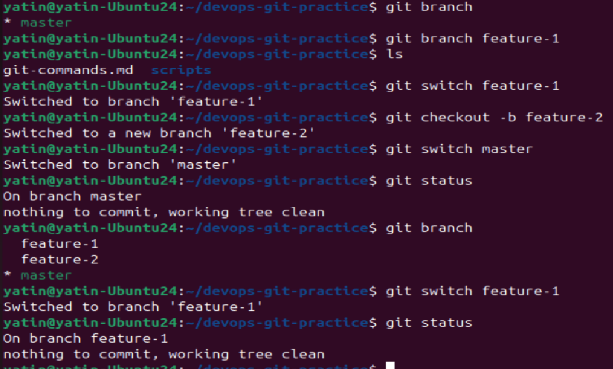

5. Try using `git switch` to move between branches — how is it different from `git checkout`?

`git switch` is simple purpose command where as `git checkout` is multi purpose command, it could be used to restore files too.

6. Make a commit on `feature-1` that does **not** exist on `main`

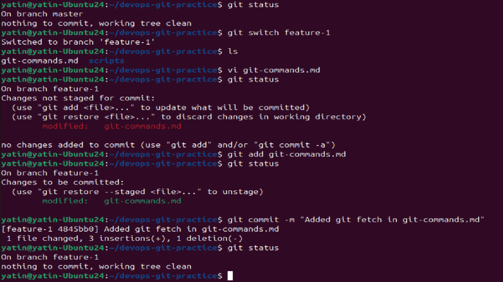

7. Switch back to `main` — verify that the commit from `feature-1` is not there

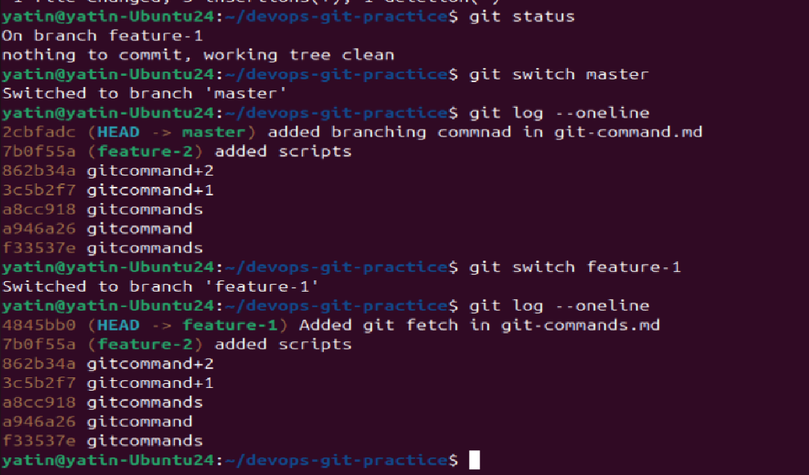

8. Delete a branch you no longer need

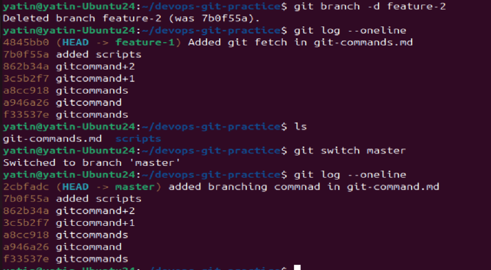

9. Add all branching commands to your `git-commands.md`

---

### Task 3: Push to GitHub
1. Create a **new repository** on GitHub (do NOT initialize it with a README)

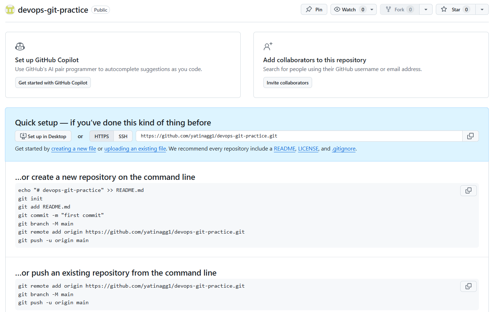

2. Connect your local `devops-git-practice` repo to the GitHub remote

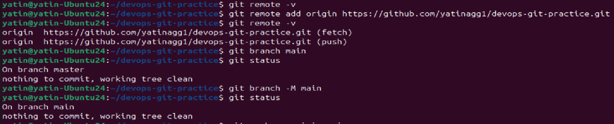

3. Push your `main` branch to GitHub

- Before we push to main we need to setup authentication method, we would use ssh method as its more secure and not use Personal Access token as in it we need to give out Access token in remote which could be expose and is less secure.
- For ssh method we would create new ssh key in our home directory and create config file in it to use that key to connect to github

`ssh-keygen` to create new public and private key pair

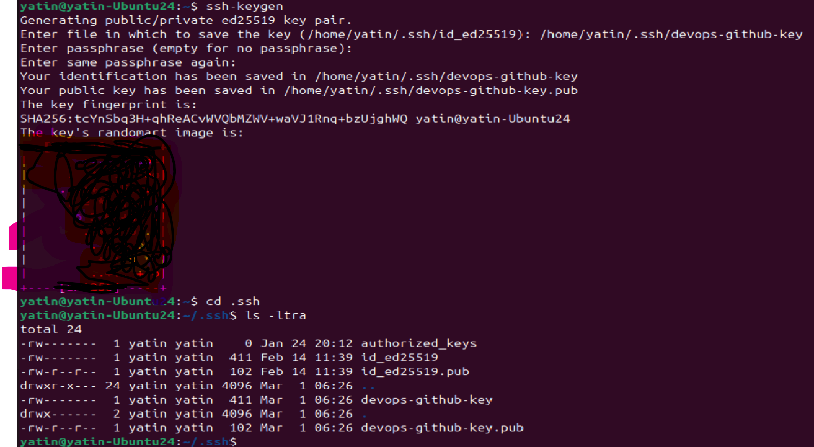

copy contents of devops-github-key.pub (public key) to github -> settings -> SSH and GPG Keys -> SSH Key

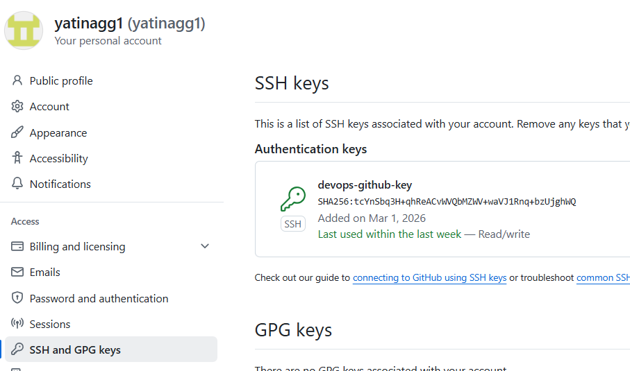

Created config file

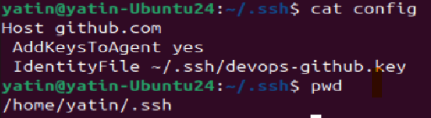

then change remote url to ssh method and then push main to remote as below

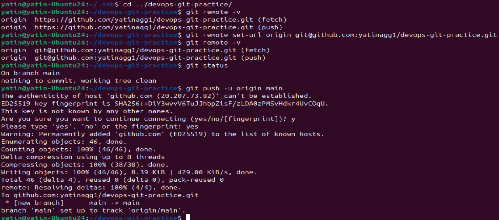

pushed main to remote on github

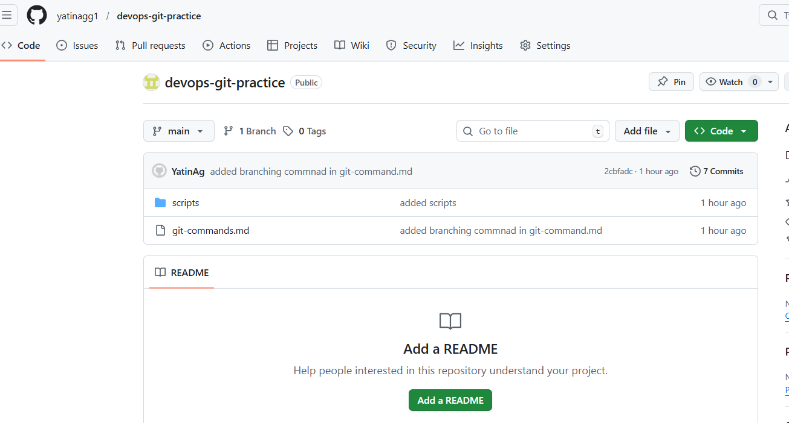

4. Push `feature-1` branch to GitHub

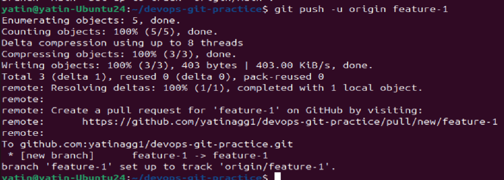

5. Verify both branches are visible on GitHub

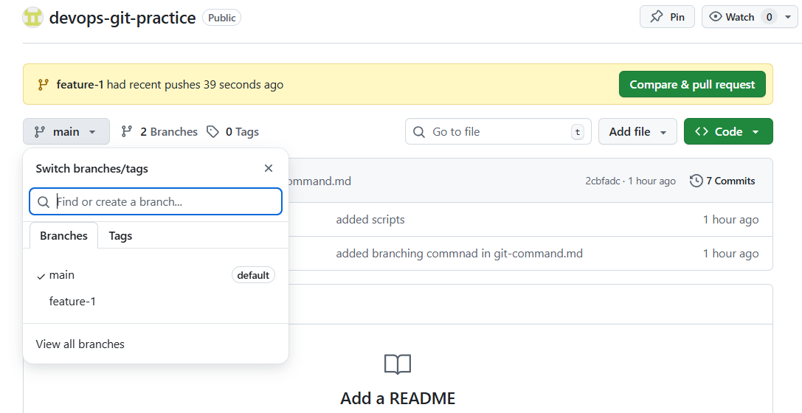

6. What is the difference between `origin` and `upstream`?
- origin is the remote url from which you have cloned your local repo, where you have read (pull) and write (push) permissions
example - https://github.com/yatinagg1/devops-git-practice.git
https://github.com/yatinagg1/90DaysOfDevOps.git

- upstream is the remote (public) repo url which you have forked on your github repo. you have read (pull) permissions
example - https://github.com/TrainWithShubham/90DaysOfDevOps.git

90DaysOfDevOps.git been forked in my github repo from remote public repo
---

### Task 4: Pull from GitHub
1. Make a change to a file **directly on GitHub** (use the GitHub editor)

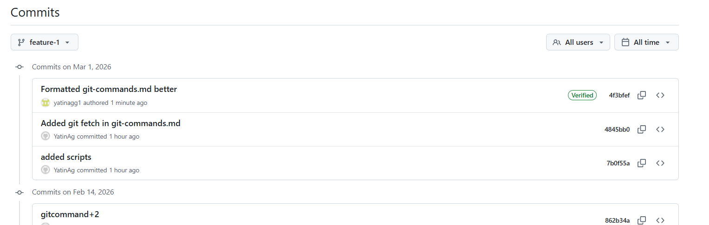

2. Pull that change to your local repo

As you pull feature-1 from github to local git also updates the changes on local logs as above

Now we made changes on github -> main , commited that in main. Then checked with `git fetch` and `git pull`

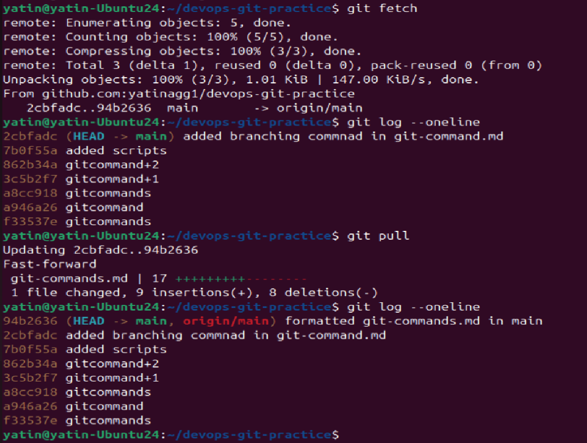

3. What is the difference between `git fetch` and `git pull`?
- `git fetch` - is used to fetch changes on remote URL only information but do not update local copy
- `git pull` - updated the local copy with changes as on remote URL

---

### Task 5: Clone vs Fork
1. **Clone** any public repository from GitHub to your local machine

Remember to use ssh method as we have set our remote URL to ssh for github and not https in earlier steps

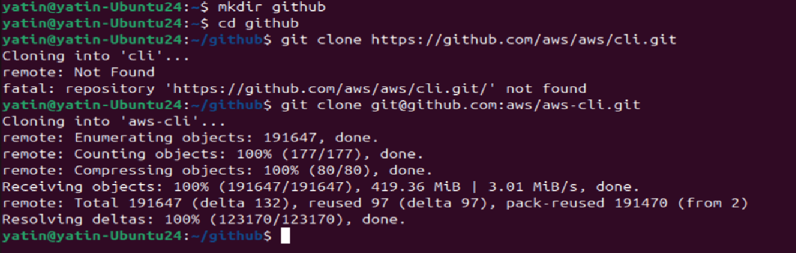

2. **Fork** the same repository on GitHub, then clone your fork

Login to your github account and go to the target repo you want to fork
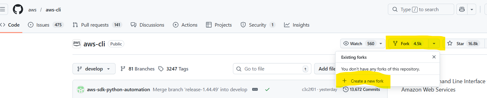

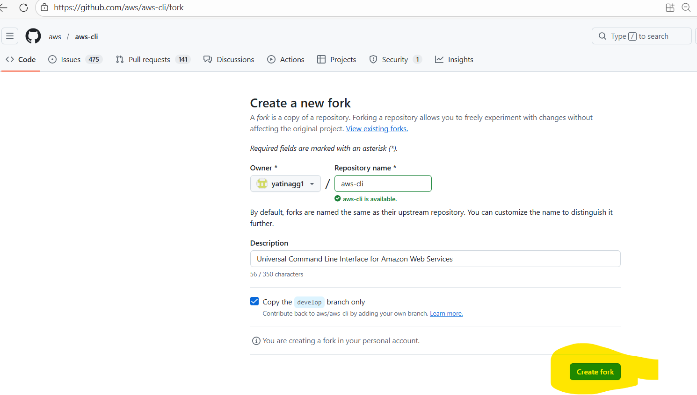

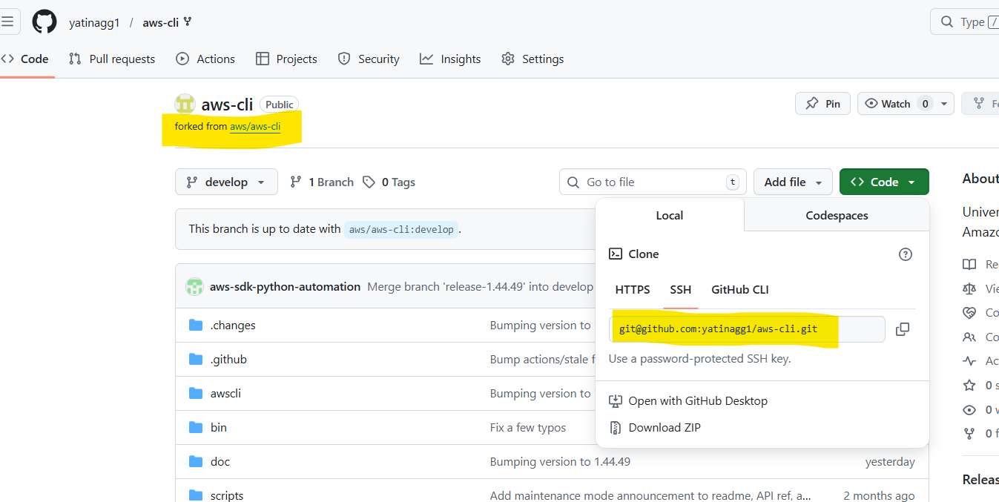

Now observe the change in code it shows instead of aws yatinagg1. Now you could clone that forked repo to your local system with that ssh url.

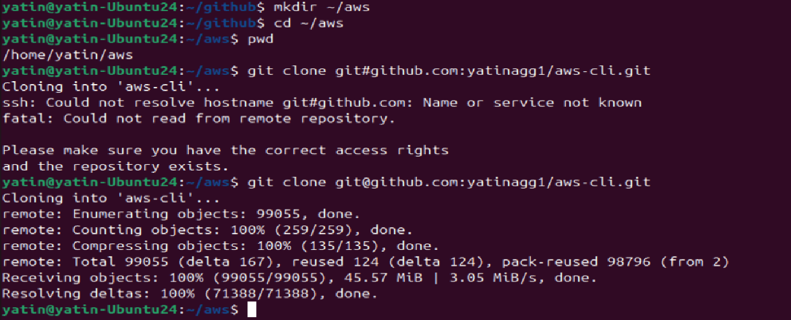

3. 
   - What is the difference between clone and fork?
   `git clone` - is to copy locally a repo on github to your system
   ` fork` - is to make your on copy on github of someone else public repo. its remote to remote copy on github

   - When would you clone vs fork?
   We use clone to make copy on local system and work on it. We use it for our repo generally where we have read/write access.
   We use fork to make copy of someones else repo and work on it. We use to have safe copy on our github. Where we could play or work with that copy.

   - After forking, how do you keep your fork in sync with the original repo?
    - on github you could `sync fork` to have updates from remote repo.

    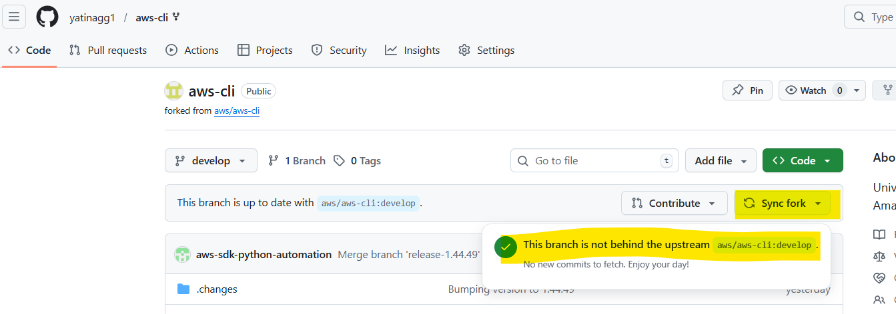

    - on local use `git pull` to have updates from your forked repo
    - make sure `git remote -v` point to your repo as your fetch(pull) and push would work for that repo

    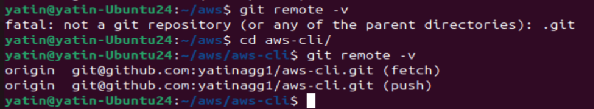

    

---

